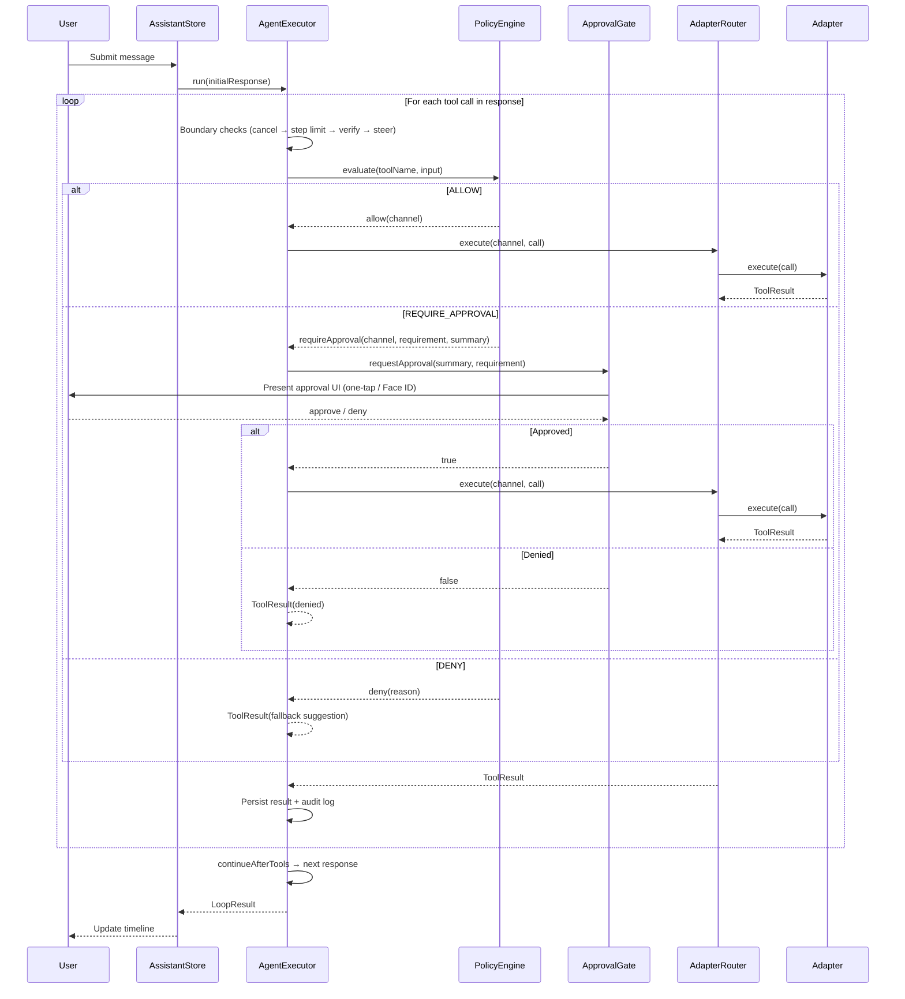

# iOS Agent Architecture Draft (Swift + LEAP)

Date: 2026-02-24
Status: Draft v1

## Scope

This draft defines:

1. A policy matrix for safe supervised automation.
2. A Swift module structure matching existing Kotlin architecture.
3. Protocol-first Swift skeletons for executor, policy, adapters, and UI store.
4. Kotlin-to-Swift mapping to preserve proven loop/guardrail behavior.

---

## Core Loop Flow



---

## 1) Policy Matrix (Enforcement Layer)

| Tier | Risk Profile | Default Behavior | Approval | Allowed Channels | Example Tools |
|---|---|---|---|---|---|
| T0 | Read-only / no side effects | Auto-run | None | AppIntent(read), backend read, local state | summarize_day, read_agenda |
| T1 | Low-risk reversible | Auto-run | None or session consent | AppIntent, internal deep link, safe Shortcut | open_section, stage_draft |
| T2 | External side effect, non-financial | Plan auto, execute gated | One-tap confirmation | AppIntent, Shortcut, deep link handoff, backend write | send_message, create_event |
| T3 | Sensitive/irreversible/high-impact | Never auto-run | Strong approval (Face ID + explicit summary) | Public APIs only, explicit confirmation path | transfer_funds, send_email_to_client |
| T4 | Disallowed/unsupported | Block + suggest fallback | N/A | None | generic cross-app tap/swipe puppeteering |

### Policy Rules

1. The model may propose any tool; policy decides if execution is allowed.
2. Execution only occurs through approved adapters/channels.
3. T2/T3 actions must include a human-readable action summary.
4. Every executed action returns structured audit metadata.
5. Denied actions must produce a fallback suggestion tool result.

---

## 2) Module Layout (Swift)

```text
AssistantApp/
  AgentCoreSwift/
    Sources/AgentCore/
      Models.swift
      BoundaryCheck.swift
      AgentExecutor.swift
      ToolExecution.swift
      ContextCompactor.swift
  PolicyEngineSwift/
    Sources/PolicyEngine/
      PolicyTypes.swift
      DefaultPolicyMatrix.swift
      DefaultPolicyEngine.swift
      BudgetGuard.swift
  SensorProviderIOS/
    Sources/SensorProvider/
      SensorTypes.swift
      IOSSensorProvider.swift
      MotionSensorProvider.swift
      LocationSensorProvider.swift
      SensorProviderRegistry.swift
  AutomationAdaptersIOS/
    Sources/AutomationAdapters/
      ExecutionAdapter.swift
      AppIntentAdapter.swift
      ShortcutAdapter.swift
      InternalDeepLinkAdapter.swift
      ExternalDeepLinkAdapter.swift
      ApprovalAdapter.swift
      LiveActivityAdapter.swift
      AdapterRouter.swift
  AssistantUI/
    Sources/AssistantUI/
      AssistantStore.swift
      ApprovalViewModel.swift
      LoopTimelineViewModel.swift
```

---

## 3) AgentCoreSwift Skeleton

### `Models.swift`

```swift
import Foundation

// MARK: - Type-Erasure Utility
// TODO: Evaluate Flight-School/AnyCodable or implement a lightweight
// type-erased Codable wrapper. For now, this typealias captures intent.
// When the concrete type is chosen, replace this alias and add `import AnyCodable`
// if using an external package.
public typealias AnyCodable = Sendable & Hashable & Codable

public struct ToolDefinition: Sendable, Hashable, Codable {
    public let name: String
    public let description: String
    public let inputSchema: [String: String]  // Simplified until AnyCodable is resolved
}

public struct ToolCall: Sendable, Hashable, Codable {
    public let id: String
    public let name: String
    public let input: [String: String]  // Simplified until AnyCodable is resolved
}

public struct TokenUsage: Sendable, Hashable, Codable {
    public let inputTokens: Int
    public let outputTokens: Int
    public let cacheReadTokens: Int
    public let cacheWriteTokens: Int

    public var totalTokens: Int { inputTokens + outputTokens }
}

public struct ChatResponse: Sendable, Hashable, Codable {
    public let text: String?
    public let toolCalls: [ToolCall]
    public let stopReason: String?
    public let usage: TokenUsage?
}

public enum ErrorSeverity: String, Sendable, Codable {
    case low, medium, high, critical
}

public enum ToolErrorCode: String, Sendable, Codable {
    case invalidInput
    case serviceUnavailable
    case privacyBlocked
    case accessDenied
    case notConfigured
    case toolNotFound
    case executionFailed
    case policyDenied
}

public struct ToolResult: Sendable, Hashable, Codable {
    public let text: String
    public let isError: Bool
    public let severity: ErrorSeverity?
    public let errorCode: ToolErrorCode?

    public init(
        text: String,
        isError: Bool = false,
        severity: ErrorSeverity? = nil,
        errorCode: ToolErrorCode? = nil
    ) {
        self.text = text
        self.isError = isError
        self.severity = severity
        self.errorCode = errorCode
    }
}

public struct ScreenSnapshot: Sendable, Hashable, Codable {
    public let hash: Int?
    public let summary: String?
}

public enum LoopExitReason: String, Sendable, Codable {
    case noTools = "no_tools"
    case cancelled = "cancelled"
    case maxSteps = "max_steps"
    case accessibilityLost = "accessibility_lost"
    case completed = "completed"
    case apiError = "api_error"
    case apiErrorAfterSteer = "api_error_after_steer"
    case policyDenied = "policy_denied"
}
```

### `BoundaryCheck.swift`

```swift
import Foundation

public enum CheckResult: Sendable {
    case `continue`
    case inject(String)
    case steer([String])
    case stop(LoopExitReason)
}

public struct LoopState: Sendable {
    public let step: Int
    public let maxSteps: Int
    public let lastToolName: String
    public let lastScreenHash: Int?
    public let preActionScreenHash: Int?
    public let lastToolWasUIMutating: Bool
    public let isCancelled: Bool
    public let pendingSteerMessages: [String]
}

public protocol BoundaryCheck: Sendable {
    func check(state: LoopState) async -> CheckResult
}

public struct CancellationCheck: BoundaryCheck {
    public init() {}
    public func check(state: LoopState) async -> CheckResult {
        state.isCancelled ? .stop(.cancelled) : .continue
    }
}

public struct StepLimitCheck: BoundaryCheck {
    public init() {}
    public func check(state: LoopState) async -> CheckResult {
        state.step >= state.maxSteps ? .stop(.maxSteps) : .continue
    }
}

public struct ActionVerificationCheck: BoundaryCheck {
    public init() {}
    public func check(state: LoopState) async -> CheckResult {
        guard
            state.lastToolWasUIMutating,
            let before = state.preActionScreenHash,
            let after = state.lastScreenHash
        else {
            return .continue
        }

        return before == after
            ? .inject("⚠️ Action may not have taken effect. Try an alternative approach.")
            : .continue
    }
}

public struct SteerCheck: BoundaryCheck {
    public init() {}
    public func check(state: LoopState) async -> CheckResult {
        state.pendingSteerMessages.isEmpty ? .continue : .steer(state.pendingSteerMessages)
    }
}
```

### `ToolExecution.swift`

```swift
import Foundation

public protocol ToolExecutionDelegate: Sendable {
    func executeToolCall(_ call: ToolCall, screen: ScreenSnapshot?) async -> ToolResult
    func isUIMutatingTool(_ toolName: String) -> Bool
    func refreshScreenAfterTool(_ toolName: String, _ result: ToolResult) async -> ScreenSnapshot?
    func addSteerMessage(_ message: String)
    func onStepStarted(_ step: Int, maxSteps: Int)
}

public protocol LoopProgressListener: Sendable {
    func onToolStarted(_ toolName: String, index: Int, total: Int)
    func onToolResult(_ toolName: String, result: ToolResult)
    func onLoopCompleted(reason: LoopExitReason, steps: Int, finalText: String?)
}

public enum LoopResult: Sendable {
    case completed(text: String?, steps: Int, reason: LoopExitReason)
}
```

### `AgentExecutor.swift`

> **⚠️ Illustrative / Aspirational:** This skeleton shows target loop semantics
> ported from Kotlin's `AgentExecutor`. Per the spec's gating strategy (§6.2),
> the actual implementation should wait until **Gate G1** (loop contract freeze).
> This code is provided to guide architectural decisions and test harness design,
> not for immediate implementation.

```swift
import Foundation

public actor AgentExecutor {
    private let delegate: ToolExecutionDelegate
    private let listener: LoopProgressListener
    private let boundaryChecks: [BoundaryCheck]
    private let maxToolSteps: Int
    private let steerMessageSource: @Sendable () -> [String]

    public init(
        delegate: ToolExecutionDelegate,
        listener: LoopProgressListener,
        boundaryChecks: [BoundaryCheck] = [
            CancellationCheck(),
            StepLimitCheck(),
            ActionVerificationCheck(),
            SteerCheck()
        ],
        maxToolSteps: Int = 25,
        steerMessageSource: @escaping @Sendable () -> [String] = { [] }
    ) {
        self.delegate = delegate
        self.listener = listener
        self.boundaryChecks = boundaryChecks
        self.maxToolSteps = maxToolSteps
        self.steerMessageSource = steerMessageSource
    }

    public func run(
        initialResponse: ChatResponse,
        initialScreen: ScreenSnapshot?,
        isCancelled: @escaping @Sendable () -> Bool,
        continueAfterTools: @escaping @Sendable () async throws -> ChatResponse
    ) async -> LoopResult {
        guard !initialResponse.toolCalls.isEmpty else {
            listener.onLoopCompleted(reason: .noTools, steps: 0, finalText: initialResponse.text)
            return .completed(text: initialResponse.text, steps: 0, reason: .noTools)
        }

        var response = initialResponse
        var screen = initialScreen
        var steps = 0

        while !response.toolCalls.isEmpty {
            let earlySteer = steerMessageSource()
            if !earlySteer.isEmpty {
                for msg in earlySteer { delegate.addSteerMessage(msg) }
                if isCancelled() {
                    listener.onLoopCompleted(reason: .cancelled, steps: steps, finalText: nil)
                    return .completed(text: nil, steps: steps, reason: .cancelled)
                }
                do {
                    response = try await continueAfterTools()
                    continue
                } catch {
                    listener.onLoopCompleted(reason: .apiErrorAfterSteer, steps: steps, finalText: nil)
                    return .completed(text: "Error: \(error.localizedDescription)", steps: steps, reason: .apiErrorAfterSteer)
                }
            }

            if isCancelled() {
                listener.onLoopCompleted(reason: .cancelled, steps: steps, finalText: nil)
                return .completed(text: nil, steps: steps, reason: .cancelled)
            }

            steps += 1
            delegate.onStepStarted(steps, maxSteps: maxToolSteps)

            for (index, call) in response.toolCalls.enumerated() {
                listener.onToolStarted(call.name, index: index, total: response.toolCalls.count)

                let preHash = screen?.hash
                let result = await delegate.executeToolCall(call, screen: screen)

                if delegate.isUIMutatingTool(call.name) {
                    screen = await delegate.refreshScreenAfterTool(call.name, result)
                }

                let state = LoopState(
                    step: steps,
                    maxSteps: maxToolSteps,
                    lastToolName: call.name,
                    lastScreenHash: screen?.hash,
                    preActionScreenHash: preHash,
                    lastToolWasUIMutating: delegate.isUIMutatingTool(call.name),
                    isCancelled: isCancelled(),
                    pendingSteerMessages: steerMessageSource()
                )

                let boundary = await evaluateBoundaryChecks(state)
                switch boundary {
                case .continue:
                    listener.onToolResult(call.name, result: result)
                case .inject(let message):
                    listener.onToolResult(call.name, result: ToolResult(text: result.text + "\n" + message, isError: result.isError, severity: result.severity, errorCode: result.errorCode))
                case .steer(let msgs):
                    for msg in msgs { delegate.addSteerMessage(msg) }
                    break
                case .stop(let reason):
                    listener.onLoopCompleted(reason: reason, steps: steps, finalText: response.text)
                    return .completed(text: response.text, steps: steps, reason: reason)
                }
            }

            do {
                response = try await continueAfterTools()
            } catch {
                listener.onLoopCompleted(reason: .apiError, steps: steps, finalText: "Error: \(error.localizedDescription)")
                return .completed(text: "Error: \(error.localizedDescription)", steps: steps, reason: .apiError)
            }
        }

        listener.onLoopCompleted(reason: .completed, steps: steps, finalText: response.text)
        return .completed(text: response.text, steps: steps, reason: .completed)
    }

    private func evaluateBoundaryChecks(_ state: LoopState) async -> CheckResult {
        var pendingInjects: [String] = []

        for check in boundaryChecks {
            let result = await check.check(state: state)
            switch result {
            case .continue:
                continue
            case .inject(let msg):
                pendingInjects.append(msg)
            case .steer:
                return result
            case .stop:
                return result
            }
        }

        if pendingInjects.isEmpty { return .continue }
        return .inject(pendingInjects.joined(separator: "\n"))
    }
}
```

---

## 4) PolicyEngineSwift Skeleton

### `PolicyTypes.swift`

```swift
import Foundation

public enum RiskTier: String, Sendable, Codable, Equatable {
    case t0, t1, t2, t3, t4
}

public enum ApprovalRequirement: String, Sendable, Codable, Equatable {
    case none
    case oneTap
    case strongBiometric
}

public enum ExecutionChannel: String, Sendable, Codable, CaseIterable, Equatable {
    case appIntent
    case shortcut
    case deepLinkInternal
    case deepLinkExternal
    case notification
    case liveActivity
    case backendAPI
}

public struct ToolPolicy: Sendable, Codable, Equatable {
    public let toolName: String
    public let tier: RiskTier
    public let reversible: Bool
    public let approval: ApprovalRequirement
    public let allowedChannels: Set<ExecutionChannel>
}

public enum PolicyDecision: Sendable, Equatable {
    case allow(channel: ExecutionChannel)
    case requireApproval(channel: ExecutionChannel, requirement: ApprovalRequirement, summary: String)
    case deny(reason: String)
}

public protocol PolicyEngine: Sendable {
    func evaluate(toolName: String, input: [String: String]) -> PolicyDecision
}
```

### `DefaultPolicyMatrix.swift`

```swift
import Foundation

public enum DefaultPolicyMatrix {
    public static let table: [String: ToolPolicy] = [
        "summarize_day": ToolPolicy(
            toolName: "summarize_day",
            tier: .t0,
            reversible: true,
            approval: .none,
            allowedChannels: [.appIntent, .backendAPI]
        ),
        "open_section": ToolPolicy(
            toolName: "open_section",
            tier: .t1,
            reversible: true,
            approval: .none,
            allowedChannels: [.appIntent, .deepLinkInternal]
        ),
        "send_message": ToolPolicy(
            toolName: "send_message",
            tier: .t2,
            reversible: false,
            approval: .oneTap,
            allowedChannels: [.appIntent, .shortcut, .notification]
        ),
        "create_event": ToolPolicy(
            toolName: "create_event",
            tier: .t2,
            reversible: true,
            approval: .oneTap,
            allowedChannels: [.appIntent, .shortcut]
        ),
        "transfer_funds": ToolPolicy(
            toolName: "transfer_funds",
            tier: .t3,
            reversible: false,
            approval: .strongBiometric,
            allowedChannels: [.backendAPI, .appIntent]
        )
    ]
}
```

### `DefaultPolicyEngine.swift`

```swift
import Foundation

public struct DefaultPolicyEngine: PolicyEngine {
    public init() {}

    public func evaluate(toolName: String, input: [String : String]) -> PolicyDecision {
        guard let policy = DefaultPolicyMatrix.table[toolName] else {
            return .deny(reason: "Tool not registered in policy matrix")
        }

        if policy.tier == .t4 {
            return .deny(reason: "Tool is disallowed on iOS runtime")
        }

        guard let channel = preferredChannel(for: policy) else {
            return .deny(reason: "No executable adapter channel available")
        }

        switch policy.approval {
        case .none:
            return .allow(channel: channel)
        case .oneTap, .strongBiometric:
            // For irreversible actions, escalate approval requirement to strong biometric
            // regardless of the configured default. This ensures destructive T2 actions
            // (e.g., send_message) get stronger confirmation when they can't be undone.
            let effectiveRequirement: ApprovalRequirement =
                (!policy.reversible && policy.approval == .oneTap) ? .strongBiometric : policy.approval
            return .requireApproval(
                channel: channel,
                requirement: effectiveRequirement,
                summary: summary(toolName: toolName, input: input, reversible: policy.reversible)
            )
        }
    }

    private func preferredChannel(for policy: ToolPolicy) -> ExecutionChannel? {
        let order: [ExecutionChannel] = [.appIntent, .backendAPI, .shortcut, .deepLinkInternal, .deepLinkExternal, .notification, .liveActivity]
        return order.first(where: { policy.allowedChannels.contains($0) })
    }

    private func summary(toolName: String, input: [String: String], reversible: Bool = true) -> String {
        let prefix = reversible ? "Run" : "⚠️ Run (irreversible)"
        return "\(prefix) \(toolName) with \(input.keys.sorted().joined(separator: ", "))"
    }
}
```

### `BudgetGuard.swift`

```swift
import Foundation

/// BudgetGuard enforces spend/usage limits across agent execution.
/// Ported from Kotlin's BudgetGuard — preserves spend gating and typed violations.
public struct BudgetViolation: Sendable, Equatable {
    public let limitName: String
    public let currentValue: Double
    public let maxValue: Double
    public let message: String
}

public protocol BudgetGuard: Sendable {
    /// Check whether the proposed tool call is within budget constraints.
    /// Returns nil if within budget, or a violation describing the breach.
    func check(toolName: String, estimatedCost: Double) -> BudgetViolation?

    /// Record actual spend after tool execution completes.
    func recordSpend(toolName: String, actualCost: Double)
}

public actor DefaultBudgetGuard: BudgetGuard {
    private var totalSpend: Double = 0
    private let maxTotalSpend: Double

    public init(maxTotalSpend: Double = 10.0) {
        self.maxTotalSpend = maxTotalSpend
    }

    public func check(toolName: String, estimatedCost: Double) -> BudgetViolation? {
        let projected = totalSpend + estimatedCost
        guard projected > maxTotalSpend else { return nil }
        return BudgetViolation(
            limitName: "total_spend",
            currentValue: totalSpend,
            maxValue: maxTotalSpend,
            message: "Tool \(toolName) would exceed budget (\(projected) > \(maxTotalSpend))"
        )
    }

    public func recordSpend(toolName: String, actualCost: Double) {
        totalSpend += actualCost
    }
}
```

---

### `ContextCompactor.swift` (Placeholder)

```swift
import Foundation

/// ContextCompactor manages conversation context window compaction.
/// The Kotlin architecture includes a compaction layer that truncates/summarizes
/// conversation history when approaching context limits.
///
/// ⚠️ Implementation deferred until G1 (compaction behavior must be stable on Android first).
/// This placeholder defines the protocol contract for the iOS port.
public protocol ContextCompactor: Sendable {
    /// Compact the conversation messages to fit within the target token budget.
    /// Returns compacted messages suitable for the next API call.
    func compact(
        messages: [ChatMessage],
        targetTokenBudget: Int
    ) async -> [ChatMessage]
}

/// Minimal message type for compaction — full definition TBD after G1.
public struct ChatMessage: Sendable, Codable {
    public let role: String
    public let content: String
}
```

---

## 5) AutomationAdaptersIOS Skeleton

### `ExecutionAdapter.swift`

```swift
import Foundation

public protocol ExecutionAdapter: Sendable {
    var channel: ExecutionChannel { get }
    func execute(call: ToolCall) async -> ToolResult
}

public protocol ApprovalGate: Sendable {
    func requestApproval(summary: String, requirement: ApprovalRequirement) async -> Bool
}
```

### `AppIntentAdapter.swift`

```swift
import Foundation
import AppIntents

public struct AppIntentAdapter: ExecutionAdapter {
    public let channel: ExecutionChannel = .appIntent

    public init() {}

    public func execute(call: ToolCall) async -> ToolResult {
        // TODO: Map call.name to concrete AppIntent types and perform.
        // Keep one adapter per bounded domain if this file grows.
        return ToolResult(text: "Executed via AppIntent: \(call.name)")
    }
}
```

### `ShortcutAdapter.swift`

```swift
import Foundation

public struct ShortcutAdapter: ExecutionAdapter {
    public let channel: ExecutionChannel = .shortcut

    public init() {}

    public func execute(call: ToolCall) async -> ToolResult {
        // TODO: invoke shortcut bridge (x-callback-url / app-owned endpoint)
        return ToolResult(text: "Executed via Shortcut: \(call.name)")
    }
}
```

### `DeepLinkAdapter.swift`

```swift
import Foundation

/// Internal deep links route within the app (e.g., navigating to a specific screen).
public struct InternalDeepLinkAdapter: ExecutionAdapter {
    public let channel: ExecutionChannel = .deepLinkInternal

    public init() {}

    public func execute(call: ToolCall) async -> ToolResult {
        // TODO: build internal URL and dispatch through app router
        ToolResult(text: "Opened via internal deep link: \(call.name)")
    }
}

/// External deep links open third-party apps or URLs via UIApplication.open.
public struct ExternalDeepLinkAdapter: ExecutionAdapter {
    public let channel: ExecutionChannel = .deepLinkExternal

    public init() {}

    public func execute(call: ToolCall) async -> ToolResult {
        // TODO: build URL and dispatch through UIApplication.open
        ToolResult(text: "Opened via external deep link: \(call.name)")
    }
}
```

### `ApprovalAdapter.swift`

```swift
import Foundation

/// ApprovalAdapter gates tool execution behind user approval. The required
/// approval level is determined by the PolicyEngine's decision, not hardcoded.
public struct ApprovalAdapter: ExecutionAdapter {
    public let channel: ExecutionChannel = .notification
    private let gate: ApprovalGate

    public init(gate: ApprovalGate) {
        self.gate = gate
    }

    /// Execute a tool call that requires approval. The `requirement` should be
    /// extracted from `PolicyDecision.requireApproval` — callers must not
    /// default to a fixed approval level.
    public func executeWithApproval(
        call: ToolCall,
        summary: String,
        requirement: ApprovalRequirement
    ) async -> ToolResult {
        let ok = await gate.requestApproval(
            summary: summary,
            requirement: requirement
        )
        return ok
            ? ToolResult(text: "Approved: \(call.name)")
            : ToolResult(text: "Denied by user", isError: true, errorCode: .accessDenied)
    }

    public func execute(call: ToolCall) async -> ToolResult {
        // Fallback for direct adapter routing without policy context.
        // Prefer executeWithApproval when PolicyDecision is available.
        return await executeWithApproval(
            call: call,
            summary: "Approve \(call.name)",
            requirement: .oneTap
        )
    }
}
```

### `LiveActivityAdapter.swift`

```swift
import Foundation
import ActivityKit

public struct LiveActivityAdapter: ExecutionAdapter {
    public let channel: ExecutionChannel = .liveActivity

    public init() {}

    public func execute(call: ToolCall) async -> ToolResult {
        // TODO: update/start activity timeline state.
        ToolResult(text: "Live Activity updated for \(call.name)")
    }
}
```

### `AdapterRouter.swift`

```swift
import Foundation

public struct AdapterRouter: Sendable {
    private let adapters: [ExecutionChannel: any ExecutionAdapter]

    public init(adapters: [any ExecutionAdapter]) {
        self.adapters = Dictionary(uniqueKeysWithValues: adapters.map { ($0.channel, $0) })
    }

    public func execute(channel: ExecutionChannel, call: ToolCall) async -> ToolResult {
        guard let adapter = adapters[channel] else {
            return ToolResult(text: "No adapter for \(channel.rawValue)", isError: true, errorCode: .serviceUnavailable)
        }
        return await adapter.execute(call: call)
    }
}
```

---

## 6) AssistantUI Skeleton

### `AssistantStore.swift`

```swift
import Foundation
import Combine

/// AssistantStore is the @MainActor-isolated UI state holder.
/// It holds a reference to `AgentExecutor` (an actor). Calls to `executor.run(...)`
/// require `await` and will hop off `@MainActor` to the executor's isolation.
/// All UI-mutating callbacks (onToolStarted, onToolResult) must hop back to
/// @MainActor before updating @Published properties. Use `Task { @MainActor in ... }`
/// or pass a MainActor-isolated listener implementation.
@MainActor
public final class AssistantStore: ObservableObject {
    @Published public private(set) var timeline: [String] = []
    @Published public private(set) var pendingApprovalSummary: String?
    @Published public private(set) var isRunning: Bool = false

    private let executor: AgentExecutor

    public init(executor: AgentExecutor) {
        self.executor = executor
    }

    public func submitUserMessage(_ text: String) {
        timeline.append("User: \(text)")
        // TODO: Create initial ChatResponse from LEAP turn and call executor.run(...)
        // Note: `await executor.run(...)` hops off @MainActor — wrap in a Task
        // and update @Published state only on @MainActor upon completion.
    }

    public func onToolStarted(_ name: String) {
        timeline.append("Tool started: \(name)")
    }

    public func onToolResult(_ name: String, _ result: ToolResult) {
        timeline.append("Tool \(name): \(result.text)")
    }
}
```

---

## 7) Kotlin -> Swift Mapping (Direct Reuse Plan)

| Kotlin source | Swift target | Reuse strategy |
|---|---|---|
| `PhoneAgentApi` | `AgentCoordinator` + `PolicyEngine` + `AdapterRouter` | Keep orchestration behavior, split concerns by protocol |
| `AgentExecutor` | `AgentExecutor` actor | Port loop semantics nearly 1:1 |
| `BoundaryCheck` set | `BoundaryCheck` protocol + checks | Keep same check ordering and stop/steer/inject precedence |
| `ToolUse` / `PhoneTools` | `ToolDefinition` + registry | Keep schema/tool naming stable for prompt compatibility |
| `BudgetGuard` | `BudgetGuardService` | Preserve spend gating + typed violations |
| `ActionVerifier` | `ActionVerifierService` | Keep post-action verification hooks where valid on iOS |
| `ChatViewModel` | `AssistantStore` | Keep UI-facing event/timeline model, move side effects to adapters |
| `ContextCompactor` | `ContextCompactor` protocol | Port compaction strategy after G1 (behavior must be stable first) |
| `BudgetGuard` | `BudgetGuard` protocol + `DefaultBudgetGuard` actor | Preserve spend gating + typed violations |
| `AndroidSensorProvider` | `IOSSensorProvider` protocol + `MotionSensorProvider` + `LocationSensorProvider` | Redesign: protocol-based with per-domain providers — see [ios-sensor-provider.md](ios-sensor-provider.md) |
| `OverlayService` | Live Activity + notifications + deep link handoff | Replace Android overlay model with review-safe iOS surfaces |

---

## 8) Immediate Build Order

1. Implement `AgentCoreSwift` contracts and unit tests for check precedence.
2. Implement `PolicyEngineSwift` with a complete matrix for v1 tools.
3. Implement `AppIntentAdapter` and `ApprovalGate` first.
4. Add `ShortcutAdapter` and `DeepLinkAdapter` fallbacks.
5. Wire `AssistantStore` to LEAP function-calling stream and route tool calls through policy.

---

## 9. Related Documents

- [ios-spec.md](ios-spec.md) — iOS MVP Specification (product goals, gating, phased timeline)
- [ios-sensor-provider.md](ios-sensor-provider.md) — IOSSensorProvider skeleton, permission model, Android→iOS sensor mapping
- [ios-testing-infrastructure.md](ios-testing-infrastructure.md) — Test doubles catalog, CI pipeline, coverage targets, phase exit criteria

