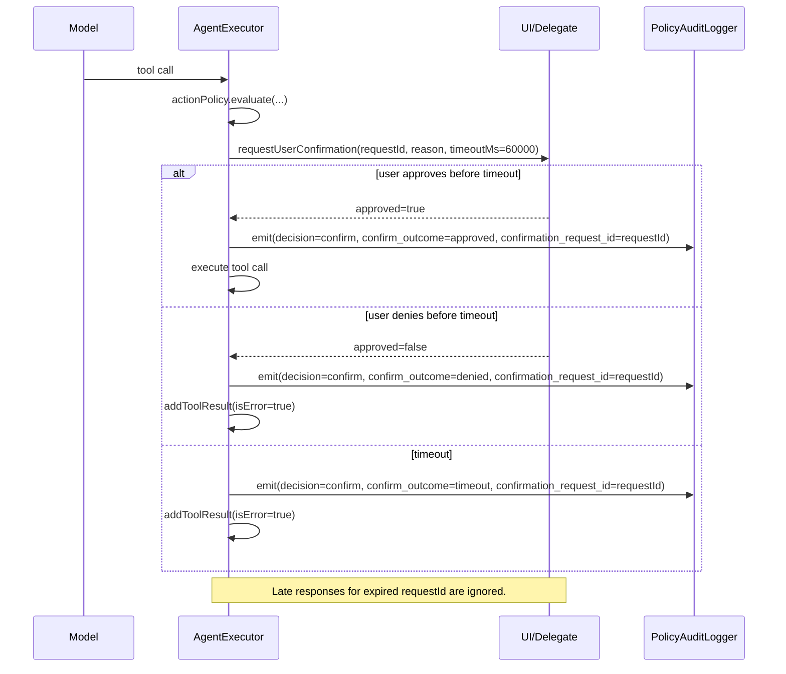

# H2.7 Action Policy Engine Spec

*Per-tool ALLOW/CONFIRM/DENY gates — the hard security boundary between model output and phone execution.*

**Status:** SPEC-stage only. This document defines required behavior and contracts for a future implementation PR. No runtime behavior changes are delivered by this spec PR.

**Issue:** The agent can execute any tool the model requests with no user confirmation. High-risk actions (sending messages, making calls, financial transactions) should require explicit user approval. There is no mechanism to block categories of actions entirely.

**Source:** `agentic-loop-v2.md §12.1`, `SPEC.md §3.5.3`

---

## Normative Legend

- `REQUIRED` / `MUST` / `MUST NOT`: normative and merge-gating for implementation PRs.
- `RECOMMENDED` / `SHOULD` / `SHOULD NOT`: informative guidance unless explicitly promoted to REQUIRED by gate text.
- `Nice-to-Have`: non-gating unless a section explicitly marks items as REQUIRED.

---

## Phase 1 Rollout (Required)

To reduce implementation ambiguity, Phase 1 rollout must include explicit safety telemetry and rollback criteria:

1. Ship behind a remotely controlled policy rollout flag.
2. Publish daily counts for `deny.financial_submit`, `deny.degraded_context_financial_submit`, `confirm.missing_app_identifier`, and `deny.egress.unapproved`.
3. Trigger rollback when any of these occur for 2 consecutive days:
   - Financial-submit deny false positives exceed 2% of non-financial interaction evaluations.
   - Confirmation timeouts exceed 10% of all confirmation prompts.
   - Audit write failures exceed 0.5% of required emissions.
4. Rollback must be config-first (signed policy snapshot swap) before code rollback.
5. Post-rollback incident notes must include affected reason codes, time window, and remediation owner.

---

## What Already Exists

- `BoundaryCheck` interface — runs **after** each tool execution (post-execution checks)
- `AgentExecutor` tool loop — iterates `response.toolCalls`, calls `delegate.executeToolCall(toolCall, screenContent)`
- `ToolCall` data class — `id: String`, `name: String`, `input: Map<String, Any>`
- `ToolCategory` enum — INTERACTION, NAVIGATION, OBSERVATION, CLIPBOARD, NOTIFICATION, MEMORY, PLANNING, RESEARCH, CORE
- `PhoneTools.categoryOf(toolName)` — maps tool names to categories
- `CheckResult` sealed class — Continue, Inject, Stop, Steer

## What's Missing

1. **Pre-execution policy check** — no gate between model request and tool execution
2. **User confirmation flow** — no mechanism to pause the loop, ask the user, then resume
3. **Action deny list** — no way to permanently block dangerous actions
4. **Rate limiting** — no throttle on action frequency (MAX_TOOL_STEPS is a step count, not a rate)
5. **First-use confirmation** — no special handling when agent interacts with an app for the first time
6. **User-configurable policies** — no settings UI for per-tool policy overrides

---

## Design

### 1. PolicyDecision — Sealed Class

```kotlin
package ai.citros.core

/**
 * Result of evaluating a tool call against the action policy.
 *
 * Evaluated BEFORE tool execution — this is the security boundary.
 */
sealed class PolicyDecision {
    /** Tool is allowed to execute without user interaction. */
    object Allow : PolicyDecision()

    /**
     * Tool requires explicit user approval before execution.
     * @param reasonCode Stable machine-readable code for audit and tests
     * @param reason Human-readable explanation shown in the confirmation dialog
     */
    data class Confirm(val reasonCode: String, val reason: String) : PolicyDecision()

    /**
     * Tool execution is blocked. The model receives a denial message.
     * @param reasonCode Stable machine-readable code for audit and tests
     * @param reason Human-readable explanation returned to the model
     */
    data class Deny(val reasonCode: String, val reason: String) : PolicyDecision()

    /**
     * Too many actions in a short period. The loop pauses before continuing.
     * @param reasonCode Stable machine-readable code for audit and tests
     * @param reason Human-readable explanation returned to the model
     * @param cooldownMs Suggested pause duration in milliseconds
     */
    data class RateLimited(
        val reasonCode: String,
        val reason: String,
        val cooldownMs: Long = 5000
    ) : PolicyDecision()
}
```

### 1a. PolicyReasonCode — Canonical Contract (Required)

```kotlin
package ai.citros.core

/**
 * Canonical reason codes emitted by policy decisions and audit records.
 * These constants are append-only in Phase 1.
 */
object PolicyReasonCode {
    fun defaultConfirmForTool(toolName: String): String = "confirm.default.$toolName"

    const val CONFIRM_UNKNOWN_TOOL = "confirm.unknown_tool"
    const val CONFIRM_SENSITIVE_APP = "confirm.sensitive_app_interaction"
    const val CONFIRM_DEGRADED_SENSITIVE = "confirm.degraded_context_sensitive"
    const val CONFIRM_FIRST_USE_APP = "confirm.first_use_app"
    const val CONFIRM_MISSING_APP_TARGET = "confirm.missing_app_identifier"
    const val CONFIRM_POLICY_EVAL_EXCEPTION = "confirm.policy_eval_exception"
    const val CONFIRM_USER_OVERRIDE = "confirm.user_override"

    const val DENY_PHASE1_TOOL = "deny.phase1.tool"
    const val DENY_EGRESS_UNAPPROVED = "deny.egress.unapproved"
    const val DENY_FINANCIAL_SUBMIT = "deny.financial_submit"
    const val DENY_DEGRADED_FINANCIAL_SUBMIT = "deny.degraded_context_financial_submit"
    const val DENY_USER_OVERRIDE = "deny.user_override"

    const val RATE_LIMIT_GLOBAL = "rate_limit.global_attempts"
    const val RATE_LIMIT_MESSAGES = "rate_limit.messaging_attempts"
}
```

### 2. ActionPolicy — Interface

```kotlin
package ai.citros.core

/**
 * Evaluates tool calls against the action policy before execution.
 *
 * This is the hard security boundary between what the model wants and
 * what actually happens on the phone. The agent module cannot modify
 * or bypass the policy module.
 *
 * Implementations should be stateful (tracking rate limits, first-use apps)
 * but thread-safe. Create one instance per AgentExecutor lifecycle.
 */
interface ActionPolicy {
    /**
     * Evaluate whether a tool call should be allowed, confirmed, denied, or rate-limited.
     *
     * @param toolCall The tool call the model is requesting
     * @param context Additional context for policy decisions (screen state, foreground app)
     * @return PolicyEvaluation containing final decision plus required observability signals
     */
    fun evaluate(toolCall: ToolCall, context: PolicyContext): PolicyEvaluation
}

/**
 * Full policy evaluation result used by executor and audit emission.
 *
 * @param decision Final enforceable policy decision
 * @param firstUseObserved True whenever first-use condition is detected for an app-targeted tool,
 * even when another reason code wins final precedence.
 */
data class PolicyEvaluation(
    val decision: PolicyDecision,
    val firstUseObserved: Boolean = false
)

/**
 * Fail-closed initialization contract:
 * - AgentExecutor requires a non-null ActionPolicy dependency.
 * - If policy wiring fails at startup, task execution does not start.
 * - There is no runtime "policy missing => allow all" fallback.
 */

/**
 * Context provided to the policy engine for richer decision-making.
 *
 * @param foregroundApp Package name of the current foreground app, if known
 * @param appIdentifier Canonical app identifier from tool input (prefer package, fallback to normalized app_name)
 * @param screenContentSummary Brief summary of visible screen content (for detecting financial/messaging context)
 * @param targetNodeHints Optional semantic hints from target UI node (text/resource id/content desc)
 * @param recentActionCount Number of tool calls executed in the current task so far
 * @param taskElapsedMs Milliseconds since the current task started
 */
data class PolicyContext(
    val foregroundApp: String? = null,
    val appIdentifier: String? = null,
    val screenContentSummary: String? = null,
    val targetNodeHints: List<String> = emptyList(),
    val recentActionCount: Int = 0,
    val taskElapsedMs: Long = 0
)
```

### 2a. Normative Policy Flow Pseudocode (Required)

Use this as the single precedence source for implementation and tests; all detailed sections below must remain consistent with this flow.

```text
evaluate(toolCall, context):
  firstUseObserved = detectFirstUseCondition(toolCall, context)   // no fail-open

  // strict precedence
  if hardDenyMatches(toolCall, context):
    return PolicyEvaluation(decision=DENY(...), firstUseObserved=firstUseObserved)

  if rateLimitMatches(toolCall, context):
    return PolicyEvaluation(decision=RATE_LIMITED(...), firstUseObserved=firstUseObserved)

  base = defaultOrUnknownConfirm(toolCall)
  firstUseAdjusted = applyFirstUseEscalation(base, toolCall, context)   // app-targeted only
  contextAdjusted = escalateForSensitiveContext(firstUseAdjusted, toolCall, context)
  finalDecision = applyUserOverrideEscalation(contextAdjusted)

  return PolicyEvaluation(decision=finalDecision, firstUseObserved=firstUseObserved)

extractEndpointHost(toolCall):
  if toolCall.name in {web_fetch, web_browse}: read input.url
  else if toolCall.name == web_search: read input.provider_endpoint
  else: return null
  parse URL; canonicalize host (lowercase, strip trailing dot, IDN->ASCII)
```

### 2b. Glossary (Required)

| Term | Definition |
|------|------------|
| `appIdentifier` | Canonical app identity from tool inputs: package form (`com.example.app`) preferred, fallback `app_name:{normalized_name}`. |
| `foregroundApp` | Canonical package of current foreground app from runtime screen context; may be null in degraded Android states. |
| app-targeted action | Tool intended to interact with a specific app context (`open_app`, `tap`, `tap_text`, `type_text`, `long_press`, `swipe`, `scroll`, `press_back`). |

### 3. DefaultActionPolicy — Production Implementation

```kotlin
package ai.citros.core

import android.util.Log

/**
 * Default action policy with sensible security defaults.
 *
 * Policy tiers:
 * - ALLOW: Safe navigation, observation, and reasoning tools
 * - CONFIRM: Actions that send data, modify contacts, or interact with new apps
 * - DENY: Explicit Phase 1 hard blocks (destructive/system bypass + financial submit intents, including unknown financial contexts)
 * - RATE_LIMITED: Automatic when action frequency exceeds thresholds
 *
 * Users can override per-tool policies via [ActionPolicyStore].
 * Overrides are a constrained type ([PolicyOverrideLevel]) and can only ESCALATE
 * (ALLOW→CONFIRM, ALLOW/CONFIRM→DENY), never RELAX.
 */
class DefaultActionPolicy(
    private val store: ActionPolicyStore? = null,
    private val egressAllowlistProvider: EgressAllowlistProvider = EmptyDenyEgressAllowlistProvider,
    private val clock: () -> Long = { System.currentTimeMillis() }
) : ActionPolicy {

    companion object {
        private const val TAG = "CitrosPolicy"

        /** Maximum tool calls per minute before rate limiting kicks in. */
        const val RATE_LIMIT_PER_MINUTE = 30

        /** Maximum message-sending actions per 2 minutes. */
        const val MESSAGE_RATE_LIMIT = 5
        const val MESSAGE_RATE_WINDOW_MS = 120_000L

        /** Explicit Phase 1 hard-deny tool names (always denied). */
        val PHASE1_DENY_TOOLS = mapOf(
            "factory_reset" to "Factory reset is blocked in Phase 1",
            "disable_policy_engine" to "Policy engine cannot be disabled by agent actions",
            "modify_audit_log" to "Audit log modifications are blocked",
            "root_shell" to "Direct root-shell execution is blocked",
            "financial_transaction" to "Financial transactions are blocked in Phase 1"
        )

        /** Default policy for each tool. */
        val DEFAULT_POLICIES: Map<String, PolicyDecision> = mapOf(
            // ALLOW — safe navigation, observation, reasoning
            "tap" to PolicyDecision.Allow,
            "tap_text" to PolicyDecision.Allow,
            "type_text" to PolicyDecision.Allow,
            "swipe" to PolicyDecision.Allow,
            "scroll" to PolicyDecision.Allow,
            "long_press" to PolicyDecision.Allow,
            "press_back" to PolicyDecision.Allow,
            "press_home" to PolicyDecision.Allow,
            "open_app" to PolicyDecision.Allow,  // First-use override below
            "open_notifications" to PolicyDecision.Allow,
            "read_screen" to PolicyDecision.Allow,
            "screenshot" to PolicyDecision.Allow,
            "think" to PolicyDecision.Allow,
            "wait" to PolicyDecision.Allow,
            "copy" to PolicyDecision.Allow,
            "paste" to PolicyDecision.Allow,
            "set_clipboard" to PolicyDecision.Allow,
            "read_notifications" to PolicyDecision.Allow,
            "web_search" to PolicyDecision.Allow,
            "web_fetch" to PolicyDecision.Allow,
            "web_browse" to PolicyDecision.Allow,
            "request_tools" to PolicyDecision.Allow,
            "list_files" to PolicyDecision.Allow,
            "read_file" to PolicyDecision.Allow,
            "recall" to PolicyDecision.Allow,
            "list_memories" to PolicyDecision.Allow,

            // CONFIRM — actions that send data or modify state
            "reply_notification" to PolicyDecision.Confirm(
                reasonCode = PolicyReasonCode.defaultConfirmForTool("reply_notification"),
                reason = "Send a notification reply"
            ),
            "tap_notification" to PolicyDecision.Confirm(
                reasonCode = PolicyReasonCode.defaultConfirmForTool("tap_notification"),
                reason = "Interact with a notification"
            ),
            "dismiss_notification" to PolicyDecision.Confirm(
                reasonCode = PolicyReasonCode.defaultConfirmForTool("dismiss_notification"),
                reason = "Dismiss a notification"
            ),
            "write_file" to PolicyDecision.Confirm(
                reasonCode = PolicyReasonCode.defaultConfirmForTool("write_file"),
                reason = "Write to device storage"
            ),
            "remember" to PolicyDecision.Confirm(
                reasonCode = PolicyReasonCode.defaultConfirmForTool("remember"),
                reason = "Store information in memory"
            ),
            "learn" to PolicyDecision.Confirm(
                reasonCode = PolicyReasonCode.defaultConfirmForTool("learn"),
                reason = "Learn a new pattern"
            )
        )

        /**
         * Apps whose screen context elevates tap/type_text to CONFIRM.
         * Package matching uses canonical "exact or dot-suffix variant" semantics.
         */
        val SENSITIVE_APP_PACKAGES = setOf(
            // Messaging
            "com.google.android.apps.messaging",  // Google Messages
            "com.whatsapp",
            "org.telegram.messenger",
            "com.discord",
            "com.slack",
            // Email
            "com.google.android.gm",  // Gmail
            "com.microsoft.office.outlook",
            // Phone
            "com.google.android.dialer",
            // Financial
            "com.chase.sig.android",
            "com.venmo",
            "com.paypal.android.p2pmobile",
            "com.squareup.cash"
        )

        private val FINANCIAL_SUBMIT_KEYWORDS = setOf(
            "pay", "send", "transfer", "confirm", "submit", "review", "complete", "authorize", "done"
        )

        /**
         * First-use confirmation applies only to app-targeted tools.
         * Non-app-targeted tools (reasoning/observation) never trigger first-use confirmation.
         */
        val APP_TARGETED_ACTION_TOOLS = setOf(
            "open_app",
            "tap", "tap_text", "type_text", "long_press",
            "swipe", "scroll", "press_back"
        )
    }

    // --- Rate limiting state (thread-safe) ---
    private val attemptTimestamps = mutableListOf<Long>()
    private val messageTimestamps = mutableListOf<Long>()
    private val seenApps = mutableSetOf<String>()

    private fun confirm(reasonCode: String, reason: String): PolicyDecision.Confirm =
        PolicyDecision.Confirm(reasonCode = reasonCode, reason = reason)

    private fun deny(reasonCode: String, reason: String): PolicyDecision.Deny =
        PolicyDecision.Deny(reasonCode = reasonCode, reason = reason)

    @Synchronized
    override fun evaluate(toolCall: ToolCall, context: PolicyContext): PolicyEvaluation {
        val now = clock()
        val firstUseObserved = peekFirstUseSignal(toolCall, context)

        // 0. Record every attempt (including denied/rate-limited) to prevent deny-loop spam.
        attemptTimestamps.add(now)

        // 1. Hard-deny rules (highest priority)
        val denyResult = checkHardDeny(toolCall, context)
        if (denyResult != null) return PolicyEvaluation(denyResult, firstUseObserved)

        // 2. Rate limit check
        val rateResult = checkRateLimit(toolCall, context, now)
        if (rateResult != null) return PolicyEvaluation(rateResult, firstUseObserved)

        // 3. Get base policy for this tool
        val basePolicy = getBasePolicy(toolCall)

        // 4. First-use app check for app-targeted actions only.
        val firstUseEscalated = checkFirstUseAppAction(toolCall, basePolicy, context)

        // 5. Context-aware escalation.
        val escalated = escalateForContext(toolCall, firstUseEscalated, context)

        // 6. Apply user overrides (can only escalate, never relax)
        val finalPolicy = applyUserOverrides(toolCall.name, escalated)

        // 7. Record message-action timestamps used by message-specific throttling.
        if (isMessageAction(toolCall, context)) messageTimestamps.add(now)

        Log.d(TAG, "evaluate: tool=${toolCall.name}, decision=${finalPolicy::class.simpleName}, app=${context.foregroundApp}")
        return PolicyEvaluation(finalPolicy, firstUseObserved)
    }

    /** Get the base policy for a tool, falling back to CONFIRM for unknown tools. */
    private fun getBasePolicy(toolCall: ToolCall): PolicyDecision {
        return DEFAULT_POLICIES[toolCall.name]
            ?: confirm(
                PolicyReasonCode.CONFIRM_UNKNOWN_TOOL,
                "Unknown tool: ${toolCall.name}"
            )
    }

    /**
     * Escalate policy based on screen context.
     * ALLOW tools become CONFIRM when used inside sensitive apps.
     */
    private fun escalateForContext(
        toolCall: ToolCall,
        current: PolicyDecision,
        context: PolicyContext
    ): PolicyDecision {
        if (current !is PolicyDecision.Allow) return current

        val isInteraction = toolCall.name in setOf("tap", "tap_text", "type_text", "long_press")
        val pkg = resolveContextPackage(context)

        // Missing package context is a degraded Android state. Stay fail-closed for high-risk interactions.
        if (isInteraction && pkg == null && looksSensitiveWithoutPackage(context)) {
            return confirm(
                PolicyReasonCode.CONFIRM_DEGRADED_SENSITIVE,
                "Foreground app is unknown in sensitive context; confirmation required"
            )
        }
        if (pkg == null) return current

        if (isInteraction && matchesAnyPackage(pkg, SENSITIVE_APP_PACKAGES)) {
            return confirm(
                PolicyReasonCode.CONFIRM_SENSITIVE_APP,
                "Interact with ${pkg.substringAfterLast('.')} (sensitive app)"
            )
        }
        return current
    }

    /** First time the agent acts in a new app context this session → CONFIRM. */
    private fun checkFirstUseAppAction(
        toolCall: ToolCall,
        current: PolicyDecision,
        context: PolicyContext
    ): PolicyDecision {
        if (!isAppTargetedAction(toolCall)) return current

        val normalizedAppId = if (toolCall.name == "open_app") {
            context.appIdentifier ?: ActionPolicyNormalizer.normalizeAppIdentifier(
                contextAppIdentifier = toolCall.input["app_package"] as? String,
                fallbackDisplayName = toolCall.input["app_name"] as? String
            ) ?: return confirm(
                PolicyReasonCode.CONFIRM_MISSING_APP_TARGET,
                "App-targeted action missing app identifier/foreground context"
            )
        } else {
            // Runtime foreground package is authoritative for interaction tools when present.
            // Tool-provided app identifiers are fallback/diagnostic only.
            resolveContextPackage(context) ?: context.appIdentifier ?: return confirm(
                PolicyReasonCode.CONFIRM_MISSING_APP_TARGET,
                "App-targeted action missing app identifier/foreground context"
            )
        }

        val firstUse = if (normalizedAppId.startsWith("app_name:")) {
            // Display-name fallback cannot use package-family semantics.
            seenApps.add(normalizedAppId)
        } else {
            val alreadySeenFamily = seenApps.any { isSamePackageFamily(normalizedAppId, it) }
            if (!alreadySeenFamily) seenApps.add(normalizedAppId)
            !alreadySeenFamily
        }

        if (firstUse) {
            // First time seeing this app family in this session.
            if (current is PolicyDecision.Allow) {
                return confirm(
                    PolicyReasonCode.CONFIRM_FIRST_USE_APP,
                    "First time acting in '$normalizedAppId' this session"
                )
            }
        }
        return current
    }

    /**
     * Hard-deny checks that run before all other policy decisions.
     * Precedence: DENY > RATE_LIMIT > CONFIRM > ALLOW.
     */
    private fun checkHardDeny(toolCall: ToolCall, context: PolicyContext): PolicyDecision.Deny? {
        val denyReason = PHASE1_DENY_TOOLS[toolCall.name]
        if (denyReason != null) return deny(PolicyReasonCode.DENY_PHASE1_TOOL, denyReason)

        if (isUrlEgressTool(toolCall) && !isApprovedEgressEndpoint(toolCall)) {
            return deny(
                PolicyReasonCode.DENY_EGRESS_UNAPPROVED,
                "Sending data to unrecognized or unapproved endpoints is blocked in Phase 1"
            )
        }

        val isInteraction = toolCall.name in setOf("tap", "tap_text", "type_text", "long_press")
        val pkg = resolveContextPackage(context)

        // Financial submit intents are app-agnostic in Phase 1.
        if (isInteraction && looksLikeFinancialSubmit(toolCall, context)) {
            if (pkg == null) {
                return deny(
                    PolicyReasonCode.DENY_DEGRADED_FINANCIAL_SUBMIT,
                    "Financial submit-like interaction with unknown foreground app is blocked in Phase 1"
                )
            }
            return deny(
                PolicyReasonCode.DENY_FINANCIAL_SUBMIT,
                "Financial submit actions are blocked in Phase 1"
            )
        }
        return null
    }

    /** Apply user overrides — constrained to escalation-only override levels. */
    private fun applyUserOverrides(toolName: String, current: PolicyDecision): PolicyDecision {
        val override = store?.getOverride(toolName) ?: return current
        return when (override) {
            PolicyOverrideLevel.CONFIRM ->
                if (current is PolicyDecision.Allow) confirm(
                    PolicyReasonCode.CONFIRM_USER_OVERRIDE,
                    "User override: confirmation required"
                )
                else current
            PolicyOverrideLevel.DENY ->
                if (current is PolicyDecision.Deny) current
                else deny(PolicyReasonCode.DENY_USER_OVERRIDE, "User override: action denied")
        }
    }

    /** Check global and message-specific rate limits. */
    private fun checkRateLimit(toolCall: ToolCall, context: PolicyContext, now: Long): PolicyDecision? {
        // Prune old timestamps
        attemptTimestamps.removeAll { now - it > 60_000 }
        messageTimestamps.removeAll { now - it > MESSAGE_RATE_WINDOW_MS }

        if (attemptTimestamps.size > RATE_LIMIT_PER_MINUTE) {
            Log.w(TAG, "Rate limit: ${attemptTimestamps.size} attempts in last minute")
            return PolicyDecision.RateLimited(
                reasonCode = PolicyReasonCode.RATE_LIMIT_GLOBAL,
                reason = "Too many tool attempts (${attemptTimestamps.size} in last minute). Pausing.",
                cooldownMs = 5000
            )
        }

        if (isMessageAction(toolCall, context) && messageTimestamps.size >= MESSAGE_RATE_LIMIT) {
            Log.w(TAG, "Message rate limit: ${messageTimestamps.size} attempts in last ${MESSAGE_RATE_WINDOW_MS/1000}s")
            return PolicyDecision.RateLimited(
                reasonCode = PolicyReasonCode.RATE_LIMIT_MESSAGES,
                reason = "Too many messaging attempts (${messageTimestamps.size} in last ${MESSAGE_RATE_WINDOW_MS/1000}s). Pausing.",
                cooldownMs = 10000
            )
        }

        return null
    }

    /** Heuristic: is this tool call likely sending a message? */
    private fun isMessageAction(toolCall: ToolCall, context: PolicyContext): Boolean {
        if (toolCall.name == "reply_notification") return true
        if (toolCall.name in setOf("tap", "tap_text")) {
            val pkg = resolveContextPackage(context) ?: return false
            val isMessagingApp = matchesAnyPackage(pkg, setOf(
                "com.google.android.apps.messaging",
                "com.whatsapp",
                "org.telegram.messenger",
                "com.discord",
                "com.slack"
            ))
            // Tapping "send" button in a messaging app
            val text = (toolCall.input["text"] as? String)?.lowercase() ?: ""
            if (isMessagingApp && (text.contains("send") || text.contains("submit"))) return true
        }
        return false
    }

    /**
     * Financial submit detection must not depend on input["text"] only.
     * It combines tool payload, semantic node hints, and screen summary commit-state signals.
     */
    private fun looksLikeFinancialSubmit(toolCall: ToolCall, context: PolicyContext): Boolean {
        val payloadHints = listOfNotNull(
            toolCall.input["text"] as? String,
            toolCall.input["content_desc"] as? String,
            toolCall.input["resource_id"] as? String,
            toolCall.input["hint"] as? String,
            toolCall.input["label"] as? String
        )
        val semanticHints = payloadHints + context.targetNodeHints
        val hintBlob = semanticHints.joinToString(" ").lowercase()
        val summary = (context.screenContentSummary ?: "").lowercase()

        val keywordHit = FINANCIAL_SUBMIT_KEYWORDS.any {
            hintBlob.contains(it) || summary.contains(it)
        }

        val targetsSpecificNode = toolCall.input["node_id"] != null || toolCall.input["resource_id"] != null
        val coordinateTap = (toolCall.name == "tap" || toolCall.name == "long_press") &&
            toolCall.input["x"] != null && toolCall.input["y"] != null
        val commitPhaseVisible = listOf("review payment", "review transfer", "confirm payment", "send money")
            .any { summary.contains(it) }

        return keywordHit || (commitPhaseVisible && (targetsSpecificNode || coordinateTap))
    }

    /** Android package match semantics: exact id or dot-suffix variant. */
    private fun matchesAnyPackage(actual: String, allowed: Set<String>): Boolean {
        return ActionPolicyNormalizer.matchesAnyPackage(actual, allowed)
    }

    /** True when package identifiers are equal or dot-suffix variants of each other. */
    private fun isSamePackageFamily(a: String, b: String): Boolean {
        return ActionPolicyNormalizer.isSamePackageFamily(a, b)
    }

    /** URL/query egress tools subject to endpoint allowlist checks. */
    private fun isUrlEgressTool(toolCall: ToolCall): Boolean {
        // Phase 1 governs web_fetch, web_browse, and web_search under one signed endpoint policy.
        return toolCall.name in setOf("web_fetch", "web_browse", "web_search")
    }

    /**
     * Endpoint is approved only when:
     * - URL is present and parseable
     * - scheme is explicitly allowed (`https` in Phase 1)
     * - host canonicalization succeeds (IDN->ASCII, lowercase, trailing-dot stripped)
     * - active snapshot is signature-verified
     * - canonical host matches signed allowlist (exact or subdomain)
     */
    private fun isApprovedEgressEndpoint(toolCall: ToolCall): Boolean {
        val url = extractEgressUrl(toolCall) ?: return false
        val uri = kotlin.runCatching { java.net.URI(url) }.getOrNull() ?: return false
        if (uri.scheme?.lowercase() != "https") return false

        val host = canonicalizeHost(uri.host) ?: return false
        val snapshot = egressAllowlistProvider.currentSnapshot()
        if (!snapshot.signatureVerified) return false

        val signedHosts = snapshot.hosts.mapNotNull(::canonicalizeHost).toSet()
        return signedHosts.any { host == it || host.endsWith(".$it") }
    }

    /**
     * Resolves egress URL field by tool contract:
     * - web_fetch/web_browse: input.url
     * - web_search: input.provider_endpoint
     */
    private fun extractEgressUrl(toolCall: ToolCall): String? {
        return when (toolCall.name) {
            "web_fetch", "web_browse" -> toolCall.input["url"] as? String
            "web_search" -> toolCall.input["provider_endpoint"] as? String
            else -> null
        }
    }

    /** Canonical host: punycode ASCII, lowercase, no trailing dot. */
    private fun canonicalizeHost(raw: String?): String? {
        val trimmed = raw?.trim()?.trimEnd('.')?.lowercase()
        if (trimmed.isNullOrBlank()) return null
        return kotlin.runCatching { java.net.IDN.toASCII(trimmed) }.getOrNull()?.lowercase()
    }

    /** Resolve canonical package signal from foreground app first, then normalized package identifier. */
    private fun resolveContextPackage(context: PolicyContext): String? {
        val foreground = context.foregroundApp?.trim()?.lowercase()
        if (!foreground.isNullOrBlank()) return foreground
        val appId = context.appIdentifier?.trim()?.lowercase() ?: return null
        if (appId.startsWith("app_name:")) return null
        return appId
    }

    /** Sensitive-context fallback used only when package resolution fails. */
    private fun looksSensitiveWithoutPackage(context: PolicyContext): Boolean {
        val summary = (context.screenContentSummary ?: "").lowercase()
        val hints = context.targetNodeHints.joinToString(" ").lowercase()
        val blob = "$summary $hints"
        val sensitiveKeywords = setOf(
            "send", "message", "reply", "email", "dial", "call",
            "bank", "wallet", "payment", "transfer", "confirm payment", "send money"
        )
        return sensitiveKeywords.any { blob.contains(it) }
    }

    /** True when first-use safeguards should apply for this tool call. */
    private fun isAppTargetedAction(toolCall: ToolCall): Boolean {
        return toolCall.name in APP_TARGETED_ACTION_TOOLS
    }

    /**
     * Non-mutating first-use signal used for required audit observability.
     * This signal is computed independent of precedence so DENY/RATE_LIMIT paths still retain visibility.
     */
    private fun peekFirstUseSignal(toolCall: ToolCall, context: PolicyContext): Boolean {
        if (!isAppTargetedAction(toolCall)) return false

        val normalizedAppId = if (toolCall.name == "open_app") {
            context.appIdentifier ?: ActionPolicyNormalizer.normalizeAppIdentifier(
                contextAppIdentifier = toolCall.input["app_package"] as? String,
                fallbackDisplayName = toolCall.input["app_name"] as? String
            ) ?: return false
        } else {
            resolveContextPackage(context) ?: context.appIdentifier ?: return false
        }

        return if (normalizedAppId.startsWith("app_name:")) {
            normalizedAppId !in seenApps
        } else {
            seenApps.none { isSamePackageFamily(normalizedAppId, it) }
        }
    }
}
```

### 3a. Egress Allowlist Provider — Runtime Contract

```kotlin
package ai.citros.core

/**
 * Runtime source for approved egress hosts.
 * Implementations must expose an atomically swappable snapshot backed by a signed payload.
 */
data class EgressAllowlistSnapshot(
    val hosts: Set<String>,
    val version: String,
    val signatureVerified: Boolean,
    val appliedAtMs: Long
)

interface EgressAllowlistProvider {
    /**
     * Current signed snapshot. Must be an immutable point-in-time view.
     * Empty hosts = fail-closed deny for URL egress tools.
     */
    fun currentSnapshot(): EgressAllowlistSnapshot

    /**
     * Convenience accessor for host checks in hot path policy code.
     * Callers MUST still validate `currentSnapshot().signatureVerified`.
     */
    fun currentHosts(): Set<String> = currentSnapshot().hosts
}

/** Default provider used before signed bootstrap completes. */
object EmptyDenyEgressAllowlistProvider : EgressAllowlistProvider {
    override fun currentSnapshot(): EgressAllowlistSnapshot = EgressAllowlistSnapshot(
        hosts = emptySet(),
        version = "bootstrap:none",
        signatureVerified = false,
        appliedAtMs = 0L
    )
}
```

Required provider semantics for U24:
1. Readers never observe partially updated host sets (`currentSnapshot()` is atomic).
2. `version` changes only after a fully verified signed payload is applied.
3. `signatureVerified=false` snapshots are treated as bootstrap/untrusted and therefore deny URL egress.
4. New snapshots become visible to all policy evaluations as a single swap.
5. Providers keep previous signed snapshot on verification failure (no downgrade to partial state).

### 3b. PolicyAuditLogger — Runtime Contract

`AgentExecutor` owns mandatory Phase 1 emission for `confirm`, `deny`, and `rate_limited` outcomes via this dependency.

```kotlin
package ai.citros.core

enum class PolicyAuditDecision { ALLOW, CONFIRM, DENY, RATE_LIMITED }
enum class PolicyConfirmOutcome { APPROVED, DENIED, TIMEOUT, NA }

data class PolicyAuditEvent(
    val eventId: String,
    val tsUtc: String,
    val taskId: String,
    val toolCallId: String,
    val toolName: String,
    val decision: PolicyAuditDecision,
    val reasonCode: String,
    val reasonText: String?,
    val foregroundApp: String?,
    val appIdentifier: String?,
    val endpointHost: String?,
    val firstUseObserved: Boolean,
    val overrideApplied: Boolean,
    val confirmOutcome: PolicyConfirmOutcome,
    val confirmationRequestId: String?
) {
    init {
        require(reasonCode.isNotBlank()) { "reasonCode is required and must be non-blank" }
        require(
            decision != PolicyAuditDecision.CONFIRM || !confirmationRequestId.isNullOrBlank()
        ) { "confirmationRequestId is required when decision=CONFIRM" }
    }
}

interface PolicyAuditLogger {
    /**
     * Must be fail-safe for policy execution:
     * write failures are surfaced via return value/logging and MUST cause
     * action execution to be skipped for the current tool call (no implicit ALLOW).
     */
    fun emit(event: PolicyAuditEvent): Result<Unit>
}

object NoopPolicyAuditLogger : PolicyAuditLogger {
    override fun emit(event: PolicyAuditEvent): Result<Unit> = Result.success(Unit)
}
```

Required audit-loss handling contract:
1. `confirm`, `deny`, and `rate_limited` paths must call a required-emission helper and inspect `Result<Unit>`.
2. If audit emission fails, executor must surface an error tool result and skip execution for that tool call.
3. Failures must be observable (log + structured metric), never swallowed.
4. Audit write failure must not mutate policy outcome to `Allow` or execute the blocked/confirmed action.

### 4. ActionPolicyStore — Persistence Interface

```kotlin
package ai.citros.core

/**
 * Persistence interface for user-configured policy overrides.
 * Ownership boundaries:
 * - Interface lives in :core (pure contract, no Android UI dependency).
 * - Production implementation lives in :chat (SharedPreferences-backed).
 * - Wiring occurs in the app/chat composition root via DI; :core never depends on :chat.
 */
enum class PolicyOverrideLevel {
    CONFIRM,  // Escalate ALLOW -> CONFIRM
    DENY      // Escalate ALLOW/CONFIRM -> DENY
}

interface ActionPolicyStore {
    /** Get user override for a specific tool, or null for default. */
    fun getOverride(toolName: String): PolicyOverrideLevel?

    /** Set user override for a tool. Null removes the override. */
    fun setOverride(toolName: String, decision: PolicyOverrideLevel?)

    /** Get all user overrides. */
    fun getAllOverrides(): Map<String, PolicyOverrideLevel>
}
```

### 5. AgentExecutor Integration

The policy check runs **before** tool execution — this is critical. It is NOT a BoundaryCheck (which runs after).

```kotlin
// In AgentExecutor.kt — inside the tool call loop, BEFORE executeToolCall:

private const val CONFIRM_TIMEOUT_MS = 60_000L

// Fail-closed init: ActionPolicy is mandatory for AgentExecutor construction.
private val actionPolicy: ActionPolicy
private val policyAuditLogger: PolicyAuditLogger

private fun extractPolicyEndpointHost(toolCall: ToolCall): String? {
    val rawUrl = when (toolCall.name) {
        "web_fetch", "web_browse" -> toolCall.input["url"] as? String
        "web_search" -> toolCall.input["provider_endpoint"] as? String
        else -> null
    } ?: return null

    val uri = rawUrl?.let { kotlin.runCatching { java.net.URI(it) }.getOrNull() } ?: return null
    val host = uri.host ?: return null
    return kotlin.runCatching { java.net.IDN.toASCII(host.trim().trimEnd('.').lowercase()) }.getOrNull()
}

private suspend fun emitRequiredPolicyAudit(
    event: PolicyAuditEvent,
    toolCall: ToolCall
): Boolean {
    val writeResult = policyAuditLogger.emit(event)
    if (writeResult.isSuccess) return true

    val errorSummary = writeResult.exceptionOrNull()?.message ?: "unknown write failure"
    delegate.addToolResult(
        toolCall.id,
        "Policy audit write failed (${event.decision}); action not executed. error=$errorSummary",
        toolCall.name,
        isError = true
    )
    return false
}

for ((toolIndex, toolCall) in response.toolCalls.withIndex()) {
    progressListener.onToolStarted(toolCall.name, toolIndex, response.toolCalls.size)

    // === ACTION POLICY CHECK (pre-execution) ===
    val policyContext = PolicyContext(
        foregroundApp = screenContent?.packageName,
        appIdentifier = ActionPolicyNormalizer.normalizeAppIdentifier(
            contextAppIdentifier = toolCall.input["app_package"] as? String,
            fallbackDisplayName = toolCall.input["app_name"] as? String
        ),
        screenContentSummary = PolicySummarySanitizer
            .sanitize(screenContent?.toToolResult())
            ?.take(200),
        targetNodeHints = listOfNotNull(
            toolCall.input["text"] as? String,
            toolCall.input["content_desc"] as? String,
            toolCall.input["resource_id"] as? String,
            toolCall.input["hint"] as? String
        ),
        recentActionCount = toolSteps,
        taskElapsedMs = System.currentTimeMillis() - taskStartMs
    )

    // Fail-secure: policy failures must never become implicit ALLOW.
    val evaluation = try {
        actionPolicy.evaluate(toolCall, policyContext)
    } catch (e: Exception) {
        PolicyEvaluation(
            decision = PolicyDecision.Confirm(
                reasonCode = PolicyReasonCode.CONFIRM_POLICY_EVAL_EXCEPTION,
                reason = "Policy evaluation failed; user confirmation required"
            ),
            firstUseObserved = false
        )
    }
    val decision = evaluation.decision

    when (decision) {
        is PolicyDecision.Allow -> { /* proceed */ }
        is PolicyDecision.Confirm -> {
            val requestId = java.util.UUID.randomUUID().toString()
            // Enforced timeout contract: no response by deadline => deny.
            val approved = kotlinx.coroutines.withTimeoutOrNull(CONFIRM_TIMEOUT_MS) {
                delegate.requestUserConfirmation(
                    toolCall = toolCall,
                    requestId = requestId,
                    reason = decision.reason,
                    timeoutMs = CONFIRM_TIMEOUT_MS
                )
            }
            when (approved) {
                true -> {
                    val emitted = emitRequiredPolicyAudit(
                        PolicyAuditEvent(
                            eventId = java.util.UUID.randomUUID().toString(),
                            tsUtc = java.time.Instant.now().toString(),
                            taskId = taskId,
                            toolCallId = toolCall.id,
                            toolName = toolCall.name,
                            decision = PolicyAuditDecision.CONFIRM,
                            reasonCode = decision.reasonCode,
                            reasonText = decision.reason,
                            foregroundApp = policyContext.foregroundApp,
                            appIdentifier = policyContext.appIdentifier,
                            endpointHost = extractPolicyEndpointHost(toolCall),
                            firstUseObserved = evaluation.firstUseObserved,
                            overrideApplied = decision.reasonCode == PolicyReasonCode.CONFIRM_USER_OVERRIDE,
                            confirmOutcome = PolicyConfirmOutcome.APPROVED,
                            confirmationRequestId = requestId
                        ),
                        toolCall
                    )
                    if (!emitted) continue
                    /* proceed */
                }
                false -> {
                    val emitted = emitRequiredPolicyAudit(
                        PolicyAuditEvent(
                            eventId = java.util.UUID.randomUUID().toString(),
                            tsUtc = java.time.Instant.now().toString(),
                            taskId = taskId,
                            toolCallId = toolCall.id,
                            toolName = toolCall.name,
                            decision = PolicyAuditDecision.CONFIRM,
                            reasonCode = decision.reasonCode,
                            reasonText = decision.reason,
                            foregroundApp = policyContext.foregroundApp,
                            appIdentifier = policyContext.appIdentifier,
                            endpointHost = extractPolicyEndpointHost(toolCall),
                            firstUseObserved = evaluation.firstUseObserved,
                            overrideApplied = decision.reasonCode == PolicyReasonCode.CONFIRM_USER_OVERRIDE,
                            confirmOutcome = PolicyConfirmOutcome.DENIED,
                            confirmationRequestId = requestId
                        ),
                        toolCall
                    )
                    if (!emitted) continue
                    delegate.addToolResult(
                        toolCall.id,
                        "User denied: ${decision.reason}",
                        toolCall.name,
                        isError = true
                    )
                    continue  // Skip to next tool call
                }
                null -> {
                    val emitted = emitRequiredPolicyAudit(
                        PolicyAuditEvent(
                            eventId = java.util.UUID.randomUUID().toString(),
                            tsUtc = java.time.Instant.now().toString(),
                            taskId = taskId,
                            toolCallId = toolCall.id,
                            toolName = toolCall.name,
                            decision = PolicyAuditDecision.CONFIRM,
                            reasonCode = decision.reasonCode,
                            reasonText = decision.reason,
                            foregroundApp = policyContext.foregroundApp,
                            appIdentifier = policyContext.appIdentifier,
                            endpointHost = extractPolicyEndpointHost(toolCall),
                            firstUseObserved = evaluation.firstUseObserved,
                            overrideApplied = decision.reasonCode == PolicyReasonCode.CONFIRM_USER_OVERRIDE,
                            confirmOutcome = PolicyConfirmOutcome.TIMEOUT,
                            confirmationRequestId = requestId
                        ),
                        toolCall
                    )
                    if (!emitted) continue
                    delegate.addToolResult(
                        toolCall.id,
                        "User confirmation timed out after ${CONFIRM_TIMEOUT_MS}ms",
                        toolCall.name,
                        isError = true
                    )
                    continue  // Skip to next tool call
                }
            }
            // Delegate/UI implementations must ignore responses tied to stale requests.
            // A response emitted after timeout cannot execute this tool call.
        }
        is PolicyDecision.Deny -> {
            val emitted = emitRequiredPolicyAudit(
                PolicyAuditEvent(
                    eventId = java.util.UUID.randomUUID().toString(),
                    tsUtc = java.time.Instant.now().toString(),
                    taskId = taskId,
                    toolCallId = toolCall.id,
                    toolName = toolCall.name,
                    decision = PolicyAuditDecision.DENY,
                    reasonCode = decision.reasonCode,
                    reasonText = decision.reason,
                    foregroundApp = policyContext.foregroundApp,
                    appIdentifier = policyContext.appIdentifier,
                    endpointHost = extractPolicyEndpointHost(toolCall),
                    firstUseObserved = evaluation.firstUseObserved,
                    overrideApplied = decision.reasonCode == PolicyReasonCode.DENY_USER_OVERRIDE,
                    confirmOutcome = PolicyConfirmOutcome.NA,
                    confirmationRequestId = null
                ),
                toolCall
            )
            if (!emitted) continue
            delegate.addToolResult(
                toolCall.id,
                "Action blocked by policy: ${decision.reason}",
                toolCall.name,
                isError = true
            )
            continue  // Skip to next tool call
        }
        is PolicyDecision.RateLimited -> {
            val emitted = emitRequiredPolicyAudit(
                PolicyAuditEvent(
                    eventId = java.util.UUID.randomUUID().toString(),
                    tsUtc = java.time.Instant.now().toString(),
                    taskId = taskId,
                    toolCallId = toolCall.id,
                    toolName = toolCall.name,
                    decision = PolicyAuditDecision.RATE_LIMITED,
                    reasonCode = decision.reasonCode,
                    reasonText = decision.reason,
                    foregroundApp = policyContext.foregroundApp,
                    appIdentifier = policyContext.appIdentifier,
                    endpointHost = extractPolicyEndpointHost(toolCall),
                    firstUseObserved = evaluation.firstUseObserved,
                    overrideApplied = false,
                    confirmOutcome = PolicyConfirmOutcome.NA,
                    confirmationRequestId = null
                ),
                toolCall
            )
            if (!emitted) continue
            kotlinx.coroutines.delay(decision.cooldownMs)
            delegate.addToolResult(
                toolCall.id,
                decision.reason,
                toolCall.name,
                isError = true
            )
            continue
        }
    }

    // Existing: execute the tool
    val actionResult = try {
        delegate.executeToolCall(toolCall, screenContent)
    } catch (e: Exception) {
        ToolResult("Error: ${e.message?.take(ERROR_MESSAGE_MAX_LENGTH)}", isError = true)
    }
    // ... rest of existing loop ...
}
```

### 5a. Screen Summary Redaction Contract (Required)

```kotlin
package ai.citros.core

object PolicySummarySanitizer {
    /**
     * Converts raw screen extraction into a policy-safe summary:
     * - remove likely credentials, OTPs, card/account numbers, and email addresses
     * - strip URLs down to host-only markers
     * - collapse whitespace and truncate before policy/audit usage
     */
    fun sanitize(raw: String?): String? { /* implementation in follow-up PR */ }
}
```

Redaction requirements:
1. `PolicyContext.screenContentSummary` must always come from `PolicySummarySanitizer.sanitize(...)`.
2. Sanitization happens before any `take(200)` truncation so high-risk tokens are removed, not clipped.
3. The same sanitized summary is the only variant allowed in policy evaluation or audit emission.
4. Raw `toToolResult()` output must never be persisted in policy/audit logs.

Sanitizer example (explicit):

```text
raw:
"OTP 482991. Card 4242 4242 4242 4242. Email sam@example.com. https://pay.example.com/transfer?token=abc123"

sanitized:
"OTP [REDACTED]. Card [REDACTED]. Email [REDACTED]. URL_HOST:pay.example.com"
```

### 6. ToolExecutionDelegate Extension

Add confirmation callback to the delegate interface:

```kotlin
// In ToolExecutionDelegate.kt (or wherever the delegate interface is defined)

/**
 * Request user confirmation for a tool call.
 *
 * Contract:
 * - `requestId` is a per-request correlation token generated by AgentExecutor.
 * - Return true only when user explicitly approves.
 * - Return false when user explicitly denies.
 * - Implementations should respect timeoutMs; AgentExecutor still enforces timeout fail-secure.
 */
suspend fun requestUserConfirmation(
    toolCall: ToolCall,
    requestId: String,
    reason: String,
    timeoutMs: Long
): Boolean = false
```

Default returns `false` (fail-closed). Production implementation in ChatViewModel shows a confirmation dialog and suspends on a CompletableDeferred.

### 7. Confirmation Timeout Contract (Required)

The implementation PR MUST satisfy all of the following:

1. `CONFIRM_TIMEOUT_MS` is `60_000` (60 seconds) and is enforced in `AgentExecutor` using `withTimeoutOrNull`.
2. Deadline starts when `PolicyDecision.Confirm` is reached for that tool call.
3. If timeout elapses before a user decision, execution is auto-denied for that tool call.
4. Timeout denial MUST be recorded via `addToolResult(toolCallId, result, toolName, isError = true)`.
5. Late UI responses after timeout are ignored and must not resurrect execution of that expired tool call.
6. Confirmation requests use a per-request correlation token/epoch so stale UI callbacks are discarded deterministically.

### 8. UI Confirmation Flow (Jarvis scope — interface only)

Not implemented in this PR, but the API surface enables it:

```kotlin
// Future ChatViewModel implementation:
override suspend fun requestUserConfirmation(
    toolCall: ToolCall,
    requestId: String,
    reason: String,
    timeoutMs: Long
): Boolean {
    val deferred = CompletableDeferred<Boolean>()
    _confirmationRequest.emit(ConfirmationRequest(requestId, toolCall, reason, deferred))
    return deferred.await()  // Suspends until user taps Allow/Deny (or timeout enforced by caller)
}
```

This document is spec-only. Runtime implementation and UI wiring are delivered in follow-up implementation PRs.

---

## App Identifier Normalization (Required)

This section refines `detectFirstUseCondition(...)` and `applyFirstUseEscalation(...)` from `§2a`.

App identity must be canonicalized before policy comparisons to prevent mismatched behavior across tools:

1. Prefer `app_package` when present; normalize with `trim().lowercase()`.
2. If package is absent, fallback to `app_name` normalized as `app_name:{trim().lowercase()}`.
3. Package matching uses exact or dot-suffix variant semantics (`com.whatsapp` matches `com.whatsapp` and `com.whatsapp.beta`).
4. `escalateForContext`, first-use checks, and message heuristics MUST share the same matching helper.
5. Construction of `PolicyContext.appIdentifier` and policy-side fallback logic MUST call the same normalization utility (`ActionPolicyNormalizer.normalizeAppIdentifier(...)`) to avoid drift.
6. For app-targeted non-`open_app` actions, first-use checks MUST treat normalized `foregroundApp` as authoritative when present; tool input app identifiers are fallback/diagnostic only.
7. If neither tool input nor `foregroundApp` yields app identity for an app-targeted action, policy MUST fail closed with `confirm.missing_app_identifier` (never implicit allow).
8. First-use checks MUST call `isAppTargetedAction(toolCall)` first and return unchanged policy for non-app-targeted tools (`think`, `wait`, `read_screen`, etc.).

## Egress Allowlist Bootstrap Contract (Required)

Unsigned (`signatureVerified=false`) or empty-host snapshots mean URL egress tools fail closed by default. The implementation PR MUST define and enforce this bootstrap lifecycle:

1. On first startup, no unsigned or ad-hoc endpoint list is accepted.
2. A signed initial allowlist payload must be provisioned before URL egress actions can succeed.
3. Signature verification failure keeps URL egress in deny mode and emits an audit event.
4. Allowlist updates are versioned, signed, and atomically swapped (no partially applied list).
5. Runtime behavior is explicit: until a valid signed allowlist is present, `web_fetch`/`web_browse`/`web_search` egress attempts return `PolicyDecision.Deny`.

This removes hidden operational dependencies and makes bootstrap a mandatory, testable setup step.

## URL Egress Input Contract (Required)

This section refines `extractEndpointHost(...)` from `§2a`.

To avoid ambiguous policy behavior:

1. `web_fetch` and URL-mode `web_browse` MUST provide `input.url` with an absolute `https://` URL.
2. `web_search` MUST provide `input.provider_endpoint` with an absolute `https://` URL for the selected provider endpoint.
3. Missing/invalid/non-HTTPS egress URL fields are treated as unrecognized endpoint and return `PolicyDecision.Deny`.
4. `web_search.query` text alone is insufficient for egress approval; endpoint approval is mandatory.
5. In Phase 1, policy treats every `web_browse` invocation as URL-mode egress for deny/allowlist checks.
6. Query-mode browsing (no `url`, e.g., `"query":"weather"`) is rejected by policy and must use `web_search` in Phase 1.
7. Host canonicalization for policy matching MUST: lowercase, strip trailing dot, and IDN-normalize via punycode.
8. Audit/event payloads store host-only (`endpoint_host`), never full URL path/query.

### `web_browse` Query-Mode Migration Note (Required)

This is a breaking contract for clients/prompts that still call query-mode `web_browse`.

1. Existing query-style `web_browse` calls (`{"query":"..."}` without `url`) will return `PolicyDecision.Deny`.
2. Migration path is mandatory: use `web_search(query, provider_endpoint)` for query intent, then pass explicit URL to `web_browse` for interactive navigation.
3. Implementation PR MUST add telemetry for denied query-mode calls and publish weekly migration progress until calls reach zero.

## `web_search` Endpoint Governance (Required)

To remove alternate egress paths, `web_search` endpoint governance is normative in Phase 1:

1. `web_search` is an egress tool and MUST be evaluated by `isUrlEgressTool(...)`.
2. Search providers MUST be represented by signed endpoint hosts in the same `EgressAllowlistProvider` snapshot used by `web_fetch`/`web_browse`.
3. `web_search` requests MUST include `provider_endpoint`; policy extracts host from this field and applies the same canonicalization and signature checks.
4. If provider endpoint host is unrecognized, unapproved, unsigned, or malformed, decision is `PolicyDecision.Deny(reasonCode=deny.egress.unapproved)`.
5. Implementation PR tests MUST include `web_search` approved and denied endpoint cases (no unconditional allow path).

## App-Targeted Action Contract (Required)

This section refines `detectFirstUseCondition(...)` from `§2a`.

First-use confirmation applies only to app-targeted tools. Non-app-targeted tools must never trigger first-use prompts.

| Tool class | Tools | First-use applies? |
|------|------|------|
| App-targeted | `open_app`, `tap`, `tap_text`, `type_text`, `long_press`, `swipe`, `scroll`, `press_back` | Yes |
| Non-app-targeted | `think`, `wait`, `read_screen`, `screenshot`, `request_tools`, `list_files`, `read_file`, `recall`, `list_memories` | No |

Implementation requirements:
1. `checkFirstUseAppAction(...)` MUST return current decision unchanged when `!isAppTargetedAction(toolCall)`.
2. For app-targeted non-`open_app` actions, normalized `foregroundApp` MUST be authoritative when present; tool-provided app id is fallback/diagnostic only.
3. `open_app` still requires `app_package` or `app_name`; missing both remains `confirm.missing_app_identifier`.
4. If app identity remains unavailable for an app-targeted action after fallback, return `confirm.missing_app_identifier` (fail-closed).
5. When first-use and sensitive-app escalation both match, `confirm.first_use_app` reason code takes precedence to preserve first-use observability.

Conformance example (required):
- In a fresh session with unseen foreground app `com.example.todo`, `think` and `wait` remain `PolicyDecision.Allow` because they are non-app-targeted tools.

## Policy Decision Examples

| Tool + Context | Expected Decision | Why |
|------|------|------|
| `tap` in `com.whatsapp` as first app-targeted action this session | `Confirm` | First-use app safeguard applies to app-targeted actions, not only `open_app` |
| `tap` with `{x,y}` in `com.chase.sig.android`, screen summary includes "Review transfer" | `Deny` | Financial commit-phase coordinate taps are treated as submit candidates in Phase 1 |
| `tap` targeting node with `resource_id=btn_send` in `com.venmo` | `Deny` | Node semantic hint indicates submit-like intent |
| `open_app` with `app_package=com.whatsapp` first time this session | `Confirm` | First-use app safeguard |
| `open_app` with `app_name=WhatsApp` and no package | `Confirm` | Uses normalized fallback identifier `app_name:whatsapp` |
| `tap` with app-targeted context but missing both tool app id and `foregroundApp` | `Confirm` | Fail-closed first-use identity rule (`confirm.missing_app_identifier`) |
| `open_app` with `app_package=com.whatsapp.beta` after prior `com.whatsapp` usage | `Allow` | Canonical package matching treats dot-suffix variant as same app family |
| `web_fetch` with `url=https://unknown.example/upload` | `Deny` | Data egress to unrecognized or unapproved endpoint is blocked |
| `web_fetch` with `url=https://api.weather.gov/points/...` and `api.weather.gov` in signed allowlist | `Allow` (or stricter via override) | Approved endpoint path is functional after bootstrap |
| `web_fetch` with `url=http://api.weather.gov/points/...` | `Deny` | Non-HTTPS URL egress is blocked in Phase 1 |
| `web_search` with `{query:"weather", provider_endpoint:"https://search.example/v1"}` and host absent from signed allowlist | `Deny` | `web_search` uses the same endpoint governance as other egress tools |
| `web_search` with `{query:"weather", provider_endpoint:"https://search.approved.example/v1"}` and host in signed allowlist | `Allow` (or stricter via override) | Signed approved search provider endpoint |
| `web_browse` with `{query:"weather boston"}` and no `url` | `Deny` | URL-mode egress tools require explicit `url`; use `web_search` for query mode |
| `reply_notification` with `{message="On my way"}` and no `url` | `Confirm` | Non-URL action follows tool default; endpoint hard-deny does not apply |
| `write_file` with `{path="/sdcard/note.txt"}` | `Confirm` | Local storage write is confirm-gated, not endpoint-denied |
| `think` in unseen foreground app context | `Allow` | Non-app-targeted tool; first-use safeguard does not apply |
| `wait` in unseen foreground app context | `Allow` | Non-app-targeted tool; first-use safeguard does not apply |

## Reason Code Mapping Table (Required)

`PolicyDecision.reasonCode` and audit `reason_code` must match exactly for the same decision path.

| Reason Code | Decision Path | User-Facing Message Template |
|------|------|------|
| `confirm.default.{tool_name}` | Default confirm-gated tool map entry | Tool-specific static reason from `DEFAULT_POLICIES` |
| `confirm.unknown_tool` | Unknown tool fallback | `Unknown tool: {tool_name}` |
| `confirm.sensitive_app_interaction` | Interaction escalation in sensitive app | `Interact with {app_short_name} (sensitive app)` |
| `confirm.degraded_context_sensitive` | Missing package + sensitive hints | `Foreground app is unknown in sensitive context; confirmation required` |
| `confirm.first_use_app` | First app-targeted action in session for that app id/family | `First time acting in '{app_identifier}' this session` |
| `confirm.missing_app_identifier` | App-targeted action without resolvable app identity (`open_app` missing package/name or interaction missing foreground context) | `App-targeted action missing app identifier/foreground context` |
| `confirm.policy_eval_exception` | `evaluate()` exception fallback | `Policy evaluation failed; user confirmation required` |
| `confirm.user_override` | User override escalates allow to confirm | `User override: confirmation required` |
| `deny.phase1.tool` | Static Phase 1 hard-deny tool list | `{phase1_deny_reason}` |
| `deny.egress.unapproved` | URL egress host parse/match fails | `Sending data to unrecognized or unapproved endpoints is blocked in Phase 1` |
| `deny.financial_submit` | Submit-like financial action in supported app | `Financial submit actions are blocked in Phase 1` |
| `deny.degraded_context_financial_submit` | Missing package + financial submit hints | `Financial submit-like interaction with unknown foreground app is blocked in Phase 1` |
| `deny.user_override` | User override escalates to deny | `User override: action denied` |
| `rate_limit.global_attempts` | Global attempt limit exceeded | `Too many tool attempts ({count} in last minute). Pausing.` |
| `rate_limit.messaging_attempts` | Message attempt limit exceeded | `Too many messaging attempts ({count} in last {window_sec}s). Pausing.` |

## Normative Source Mapping (Required)

To prevent drift between high-level `docs/SPEC.md` policy bullets and this document, implementation PRs MUST preserve this mapping:

| High-Level Policy Bullet (`docs/SPEC.md`) | H2 Normative Anchor | Primary Reason Codes |
|------|------|------|
| First-use confirmation for unseen app context | `§2a` normative flow + `checkFirstUseAppAction(...)`, test IDs `U5`, `U22`, `U22a` | `confirm.first_use_app`, `confirm.missing_app_identifier`, audit `first_use_observed` |
| Hard deny list | `PHASE1_DENY_TOOLS`, deny precedence contract | `deny.phase1.tool` |
| Exfiltration deny for unrecognized/unapproved endpoints | `isUrlEgressTool(...)`, `isApprovedEgressEndpoint(...)`, URL input contract | `deny.egress.unapproved` |
| Financial submit blocked app-agnostically (including unknown/degraded context) | `looksLikeFinancialSubmit(...)`, `checkHardDeny(...)`, test IDs `U10`, `U10b`, `U10c` | `deny.financial_submit`, `deny.degraded_context_financial_submit` |
| Rate limiting for rapid actions/message spam | `checkRateLimit(...)`, test IDs `U6`, `U7`, `U18` | `rate_limit.global_attempts`, `rate_limit.messaging_attempts` |
| Unknown tools treated conservatively | `getBasePolicy(...)` fallback + test `U3` | `confirm.unknown_tool` |
| Confirmation fail-closed timeout | timeout contract + `AgentExecutor` path | `confirm.*` with `confirm_outcome=timeout` |
| Audit completeness for confirm/deny/rate-limited | required audit-loss handling contract + `U25`/`U25a`/`U25b` + `I6` | reason code must equal policy decision reason; `first_use_observed` must be carried through |

---

## Error Handling

- **Policy wiring missing at startup**: AgentExecutor creation fails and task execution does not start (fail-closed boot path).
- **Policy evaluation throws**: `try/catch` around `actionPolicy.evaluate(...)` and force `PolicyEvaluation(decision=PolicyDecision.Confirm(reasonCode=confirm.policy_eval_exception, ...), firstUseObserved=false)` (fail-secure, never fail-open).
- **User confirmation timeout**: Hard timeout at 60 seconds in `AgentExecutor`; timeout behaves as deny and emits an error tool result.
- **Audit emission failure**: `confirm`/`deny`/`rate_limited` paths must inspect `emit(...)` result; on failure, surface an error tool result and skip that tool call.
- **Unknown tool name**: Default policy is CONFIRM (not ALLOW). Unknown tools are treated with suspicion.
- **Missing/unknown foreground app on interaction tools**: Never implicitly ALLOW sensitive-looking interactions when context degrades; require CONFIRM at minimum, and DENY for financial-submit signals.
- **Precedence contract**: DENY is evaluated before rate limiting (`DENY > RATE_LIMIT > CONFIRM > ALLOW`).
- **Rate limit during CONFIRM wait**: Rate limit cooldown and confirmation timeout are independent; confirmation timeout tracks only user response wait.
- **Rate-limit accounting**: Global attempt throttling counts all evaluated tool calls (including denied attempts) to suppress deny-loop spam.
- **Endpoint definitions**: `unrecognized` = host cannot be parsed/canonicalized from tool input; `unapproved` = host parsed successfully but not present in the active signed allowlist.

---

## Pressure Test

### Edge Cases
1. **No policy configured**: initialization fails and tool loop does not start (fail-closed).
2. **Empty overrides store**: Falls through to DEFAULT_POLICIES → sensible defaults.
3. **User tries to relax DENY to ALLOW**: impossible via type contract (`PolicyOverrideLevel` has only `CONFIRM`/`DENY`); relaxation path does not exist.
4. **Rapid tool calls (30+/min)**: Rate limiter fires, returns RateLimited with 5s cooldown. Model sees the message and should slow down.
5. **Message spam (5+ in 2 min)**: Separate message rate limit fires with 10s cooldown.
6. **First app-targeted action then same app family again**: First action → CONFIRM ("First time acting..."). Later action in same app family → ALLOW (already in `seenApps` set).
7. **open_app with missing `app_package` and `app_name`**: Returns CONFIRM (missing required arg is treated conservatively).
8. **Sensitive app escalation**: tap/type_text in WhatsApp → CONFIRM even though base policy is ALLOW.
9. **Financial submit intent**: submit-like actions (text, node-targeted, or coordinate tap during commit phase) are DENY in Phase 1 even outside known finance-package allowlists.
10. **Tool call batch with mixed policies**: Each tool in the batch evaluated independently. Deny/Confirm for one doesn't affect others.
11. **User denies confirmation**: Model receives "User denied: {reason}" as error tool result. Can reason about it.
12. **Confirmation timeout**: No response in 60s → auto-deny error result, tool not executed.
13. **Policy engine exception**: `evaluate()` throws → forced CONFIRM path instead of ALLOW.
14. **Concurrent evaluate() calls**: @Synchronized on evaluate() prevents race conditions on rate limit state.
15. **Clock manipulation**: Injected clock lambda enables deterministic testing.
16. **Session boundary**: seenApps resets per AgentExecutor lifecycle (fresh DefaultActionPolicy per task).
17. **Late UI allow after timeout**: stale callback is ignored; expired tool call remains denied.
18. **Precedence conflict**: a tool that matches both deny and rate-limit conditions returns DENY.
19. **Context degradation during interaction**: foreground package missing + sensitive hints => CONFIRM (not ALLOW).
20. **Context degradation with financial submit signals**: foreground package missing + submit heuristics => DENY.

### Performance
- `evaluate()`: O(1) map lookup + O(n) timestamp prune where n is the number of attempts retained in the active window.
- Under high-frequency deny/rate-limit loops, n can exceed 30 transiently before prune catches up; expected latency still stays low for Phase 1 workloads.
- Rate limit timestamp lists are pruned on each call and bounded by the configured window + incoming attempt pressure (not a strict fixed-size cap).
- Implementation PR must report measured latency from benchmark/test runs; this spec does not assert platform-specific timing values.

### Token Budget
- Policy denial messages: ~15 tokens per denial, only when triggered.
- Confirmation reasons are always UI-visible and become model-visible on deny/timeout tool results (intentionally short, target ~10 tokens).
- Rate limit messages: ~20 tokens, infrequent.
- No additions to system prompt — policy is enforced at the execution layer.

### Security
- Policy evaluation runs in the same process but is architecturally separated from the agent module.
- User overrides can only ESCALATE (more restrictive), never RELAX.
- Unknown tools default to CONFIRM, not ALLOW.
- Rate limiting prevents automated message/action spam even if the model is injection-compromised.
- Phase 1 DENY scope is explicit (`PHASE1_DENY_TOOLS` + unrecognized/unapproved endpoint egress for `web_fetch`/`web_browse`/`web_search` + app-agnostic financial submit intents, including degraded unknown-app context).
- DENY cannot be overridden by user config — requires code change. This is intentional for Phase 1.

---

## Policy Decision Audit Schema (Required in Phase 1)

Audit payloads must reflect evaluation signals from `§2a` (`decision` + `firstUseObserved`).

To keep implementation and incident triage behavior aligned, policy decisions MUST be logged with a compact, privacy-aware schema for `confirm`, `deny`, and `rate_limited` outcomes in Phase 1:

| Field | Type | Required | Notes |
|------|------|----------|------|
| `event_id` | string (UUID) | yes | Unique record id |
| `ts_utc` | string (RFC3339) | yes | Decision timestamp |
| `task_id` | string | yes | Correlates decisions within one agent task |
| `tool_call_id` | string | yes | Matches model tool call id |
| `tool_name` | string | yes | Requested tool |
| `decision` | enum (`allow`,`confirm`,`deny`,`rate_limited`) | yes | Final policy decision |
| `reason_code` | string | yes | Stable machine-readable reason (`deny.egress.unapproved`, etc.) |
| `reason_text` | string | no | Human-readable summary, redacted |
| `foreground_app` | string | no | Canonical package id if known |
| `app_identifier` | string | no | Canonical app id or `app_name:*` fallback |
| `endpoint_host` | string | no | Host only, never full URL/query |
| `first_use_observed` | boolean | yes | True when first-use condition is detected, even if final `reason_code` is different |
| `override_applied` | boolean | yes | Whether user override escalated decision |
| `confirm_outcome` | enum (`approved`,`denied`,`timeout`,`n/a`) | yes | Confirmation flow result |
| `confirmation_request_id` | string | conditional | Required when `decision=confirm`; null allowed for non-confirm decisions |

Redaction rules:
- Never log message bodies, full screen text, credentials, or raw URLs with query/path.
- Store only endpoint host and short reason codes.
- Truncate `reason_text` and UI hints to fixed max lengths.

Retention guidance:
- Keep local policy audit records for 30 days by default.
- Regional/legal retention overrides must be supported through signed policy config (for example, shorter defaults where required by local regulation), while preserving 30 days as the baseline fallback.
- Allow user-export with explicit consent.
- Purge on user request with a verified delete flow.

Required Phase 1 audit contract:
- Emit one audit event for every `confirm`, `deny`, and `rate_limited` decision.
- Audit write failures must not convert decisions to implicit `allow`; decision handling remains fail-closed.
- `allow` is present in the enum for forward compatibility; `allow` emission remains optional/sampled in Phase 1, while `confirm`/`deny`/`rate_limited` emission is mandatory.
- `ts_utc` and `reason_code` are required non-null fields on every emitted record.
- `confirmation_request_id` is required whenever `decision=confirm` and may be null only for non-confirm decisions.
- `first_use_observed` is required on all emitted events and preserves first-use observability even when another reason wins final precedence.

### End-to-End Example: Confirmation Timeout + Audit Emission

1. Model requests tool call `{"id":"tc_42","name":"reply_notification","input":{"message":"yes"}}`.
2. Policy returns `PolicyDecision.Confirm(reasonCode="confirm.default.reply_notification", reason="Send a notification reply")`.
3. `AgentExecutor` starts `withTimeoutOrNull(60_000)` confirmation wait.
4. User does not respond before deadline.
5. Executor skips tool execution and writes `addToolResult(..., isError=true)` with timeout message.
6. Audit sink emits one record with `decision="confirm"` and `confirm_outcome="timeout"` for `tc_42`.
7. If the audit sink write fails, executor surfaces an audit-write error tool result and still skips execution.

Example Phase 1 audit payload:

```json
{
  "event_id": "f5ed9ac5-2e56-4f9f-a66d-8457ea5ddf9e",
  "ts_utc": "2026-02-22T19:05:12Z",
  "task_id": "task_abc123",
  "tool_call_id": "tc_42",
  "tool_name": "reply_notification",
  "decision": "confirm",
  "reason_code": "confirm.default.reply_notification",
  "reason_text": "Send a notification reply",
  "foreground_app": "com.google.android.apps.messaging",
  "app_identifier": "com.google.android.apps.messaging",
  "first_use_observed": false,
  "override_applied": false,
  "confirm_outcome": "timeout",
  "confirmation_request_id": "1f89db28-01df-4ee3-a57c-1ce6dc5f1ab5"
}
```

### Confirm Flow Sequence (Recommended)



## Deny Rule Threat Mapping (Nice-to-Have, Recommended)

| Deny Rule | Threat Class |
|------|------|
| `factory_reset` | Integrity bypass / destructive action |
| `disable_policy_engine` | Integrity bypass / control-plane tampering |
| `modify_audit_log` | Integrity bypass / forensic evasion |
| `root_shell` | Privilege abuse / arbitrary execution |
| `financial_transaction` + app-agnostic financial submit intents (including degraded unknown-app context) | Financial fraud |
| URL egress to unrecognized/unapproved endpoints | Exfiltration / prompt-injection data theft |

## Financial Heuristic False-Positive Budget (Nice-to-Have, Recommended)

Phase 1 tuning targets for `looksLikeFinancialSubmit(...)`:
1. False-positive budget: <= 2% of non-financial interaction evaluations over rolling 7 days.
2. False-negative budget: 0 tolerated for known financial submit surfaces and labeled unsupported-finance surfaces in the replay corpus.
3. Escalation policy: if false positives exceed budget for 2 consecutive days, temporarily downgrade affected heuristic path from `Deny` to `Confirm` only with explicit security sign-off.
4. Telemetry requirement: publish daily counts by reason code (`deny.financial_submit`, `deny.degraded_context_financial_submit`, corresponding confirm fallbacks).
5. Regression gate: heuristic changes require replay against a labeled fixture corpus before release.

---

## Required Test Matrix (Implementation PR Gate)

All tests below are REQUIRED in the implementation PR and should be written first (TDD). CI merge gate: 100% pass for each row.

| Layer | Test ID | Scenario | Expected |
|------|---------|----------|----------|
| Unit (`DefaultActionPolicy`) | U1 | Known ALLOW tool (`tap`) in non-sensitive app | `PolicyDecision.Allow` |
| Unit (`DefaultActionPolicy`) | U2 | Known CONFIRM tool (`reply_notification`) | `PolicyDecision.Confirm` with stable `reasonCode` + reason |
| Unit (`DefaultActionPolicy`) | U3 | Unknown tool | `PolicyDecision.Confirm` with `reasonCode=confirm.unknown_tool` |
| Unit (`DefaultActionPolicy`) | U4 | Sensitive app escalation (`tap` in WhatsApp) | `Allow -> Confirm` escalation |
| Unit (`DefaultActionPolicy`) | U5 | First app-targeted action in session (`open_app` or interaction with resolvable app id) first/second invocation | first = Confirm, second = Allow |
| Unit (`DefaultActionPolicy`) | U6 | Global rate limit exceeded | `PolicyDecision.RateLimited` |
| Unit (`DefaultActionPolicy`) | U7 | Message rate limit exceeded | `PolicyDecision.RateLimited` |
| Unit (`DefaultActionPolicy`) | U8 | Override escalation only (typed override) | `PolicyOverrideLevel.CONFIRM` escalates ALLOW only; `PolicyOverrideLevel.DENY` escalates ALLOW/CONFIRM; relaxation path absent |
| Unit (`DefaultActionPolicy`) | U9 | Phase 1 deny tool (`root_shell`) | `PolicyDecision.Deny` |
| Unit (`DefaultActionPolicy`) | U10 | Financial submit detection in known finance app (text/node/commit-phase coordinate variants) | `PolicyDecision.Deny` |
| Unit (`DefaultActionPolicy`) | U10a | Missing `foregroundApp` + sensitive interaction hints | `PolicyDecision.Confirm` (fail-closed, no implicit ALLOW) |
| Unit (`DefaultActionPolicy`) | U10b | Missing `foregroundApp` + financial submit hints | `PolicyDecision.Deny` |
| Unit (`DefaultActionPolicy`) | U10c | Financial submit detection in unsupported/other app context with submit-like signals | `PolicyDecision.Deny` (app-agnostic financial deny) |
| Unit (`AgentExecutor`) | U11 | `evaluate()` throws exception | fail-secure CONFIRM path; no implicit ALLOW |
| Unit (`AgentExecutor`) | U12 | Confirmation denied | tool skipped; `addToolResult(..., isError=true)` |
| Unit (`AgentExecutor`) | U13 | Confirmation timeout at 60s | tool skipped; timeout message; `isError=true` |
| Unit (`AgentExecutor`) | U14 | Policy DENY | tool skipped; denial message; `isError=true` |
| Unit (`AgentExecutor`) | U15 | RateLimited decision | cooldown delay then skip; `isError=true` |
| Unit (`AgentExecutor`) | U16 | Late UI response arrives after timeout | stale response ignored; expired tool remains skipped |
| Unit (`DefaultActionPolicy`) | U17 | Precedence conflict: deny + rate-limit both match | `PolicyDecision.Deny` (deny wins) |
| Unit (`DefaultActionPolicy`) | U18 | Precedence conflict: rate-limit + confirm both match | `PolicyDecision.RateLimited` (rate limit wins) |
| Unit (`DefaultActionPolicy`) | U19 | Package matching consistency across `escalateForContext` and `isMessageAction` | same canonical match result for variant packages |
| Unit (`DefaultActionPolicy`) | U20 | URL egress to unapproved endpoint (`web_fetch`/`web_browse`/`web_search`) | `PolicyDecision.Deny` |
| Unit (`DefaultActionPolicy`) | U21 | Non-URL actions (`reply_notification`, `write_file`) without `url` | Remain `PolicyDecision.Confirm` per defaults; no endpoint hard-deny |
| Unit (`DefaultActionPolicy`) | U22 | First-use app-family canonicalization (`com.x` then `com.x.beta`) | first = Confirm, second = Allow |
| Unit (`DefaultActionPolicy`) | U22a | First-use identity precedence for interaction tools when both `foregroundApp` and tool app id are present but disagree | `foregroundApp` identity is authoritative for first-use tracking/decision |
| Unit (`DefaultActionPolicy`) | U23 | URL egress to approved endpoint after signed allowlist bootstrap | non-`Deny` decision (default `Allow` unless escalated by other policy) |
| Unit (`DefaultActionPolicy`) | U24 | Egress provider atomic swap to signed host set | decisions switch from deny->non-deny without partial host visibility |
| Unit (`DefaultActionPolicy`) | U24a | Signature gating on egress snapshot | `signatureVerified=false` snapshot denies even when host exists |
| Unit (`DefaultActionPolicy`) | U24b | Egress host canonicalization | IDN/trailing-dot/uppercase host variants normalize and match signed allowlist |
| Unit (`DefaultActionPolicy`) | U24c | URL input enforcement for egress tools | missing/non-HTTPS `url` for `web_fetch`/URL-mode `web_browse` returns `PolicyDecision.Deny` |
| Unit (`DefaultActionPolicy`) | U24d | `web_search` endpoint input enforcement | missing/non-HTTPS `provider_endpoint` for `web_search` returns `PolicyDecision.Deny` |
| Unit (`AgentExecutor`) | U25 | Audit emission required paths | `confirm`/`deny`/`rate_limited` each emit one schema-valid audit record with matching `reason_code` |
| Unit (`AgentExecutor`) | U25a | Confirmation correlation token wiring | `requestUserConfirmation(requestId=...)` propagates stable request id into audit event and stale callbacks are ignored |
| Unit (`AgentExecutor`) | U25b | Audit write failure handling | `emit(...)` failure surfaces `isError=true` tool result and skips action execution |
| Unit (`DefaultActionPolicy`) | U25d | `confirm.missing_app_identifier` reason text consistency across `open_app` and non-`open_app` app-targeted failures | Message equals mapping template exactly; no path-specific drift |
| Unit (`AgentExecutor`) | U25c | First-use observability signal | `first_use_observed=true` is emitted whenever first-use condition is true, including paths where final decision reason is not `confirm.first_use_app` |
| Unit (`PolicySummarySanitizer`) | U26 | Screen summary contains OTP/card/email/raw URL | sanitizer removes/redacts sensitive tokens before policy/audit use |
| Integration (`EgressAllowlistProvider`) | U27 | Signed snapshot swap under concurrent reads | readers observe old-or-new full snapshot only; never partial host set |
| Integration (`AgentExecutor` + delegate + conversation) | I1 | Confirm approved | tool executes and normal tool result appended |
| Integration (`AgentExecutor` + delegate + conversation) | I2 | Mixed batch Allow/Confirm/Deny | each tool handled independently |
| Integration (`PhoneAgentApi` conversation serialization) | I3 | Policy-produced denial result | serialized tool result marks `is_error: true` from `isError=true` |
| Integration (`PhoneAgentApi` conversation serialization) | I4 | Successful tool result | serialized tool result marks `is_error: false` |
| Integration (`AgentExecutor` + overrides + policy) | I5 | Override attempts to relax DENY (`DENY->ALLOW`) | impossible by API shape (`PolicyOverrideLevel`), verify no persisted relax state is accepted |
| Integration (`AgentExecutor` + audit logger) | I6 | Confirm approve/deny/timeout paths | exactly one audit event per decision path with correct `confirm_outcome`, `confirmationRequestId`, and `first_use_observed` |

### Executable Test Plan (Implementation PR Gate)

Implementation PR is non-mergeable until all commands below pass in CI and locally:

```bash
./gradlew :core:testDebugUnitTest --tests "*DefaultActionPolicyTest*"
./gradlew :core:testDebugUnitTest --tests "*AgentExecutorTest*"
./gradlew :core:testDebugUnitTest --tests "*PolicySummarySanitizerTest*"
./gradlew :core:testDebugUnitTest --tests "*EgressAllowlistProviderTest*"
./gradlew :core:testDebugUnitTest --tests "*PhoneAgentApi*"
./gradlew :core:testDebugUnitTest --tests "*ActionPolicyIntegrationTest*"
```

Required suite-to-matrix coverage:
- `*DefaultActionPolicyTest*` must include `U1-U10c`, `U17-U24d`, `U25d`.
- `*AgentExecutorTest*` must include `U11-U16`, `U25`, `U25a`, `U25b`, `U25c`.
- `*PolicySummarySanitizerTest*` must include `U26`.
- `*EgressAllowlistProviderTest*` must include `U27`.
- `*PhoneAgentApi*` tests must include `I3-I4`.
- `*ActionPolicyIntegrationTest*` must include `I1`, `I2`, `I5`, and `I6`.

Gate rules:
- This SPEC PR remains RFC-only and does not satisfy the implementation gate.
- The follow-up implementation PR must include RED->GREEN->REFACTOR evidence for U1-U27, U24d, and I1-I6.
- Do not mark feature complete or request merge on behavior until the executable test plan passes.

`ToolResult is_error semantics (required):`
- Any policy-caused non-execution outcome (deny, user deny, timeout, rate-limit skip) MUST be recorded with `isError = true`, which serializes to `is_error: true`.
- Executed successful actions MUST keep `isError = false` (`is_error: false`).

---

## Planned Implementation Files (Future PR)

These are target files for the follow-up implementation PR (not changed by this spec PR):

| File | Planned change |
|------|--------|
| `android/core/src/main/kotlin/ai/citros/core/PolicyDecision.kt` | NEW — sealed class for policy outcomes |
| `android/core/src/main/kotlin/ai/citros/core/ActionPolicy.kt` | NEW — policy evaluation interface + `PolicyContext` |
| `android/core/src/main/kotlin/ai/citros/core/ActionPolicyNormalizer.kt` | NEW — shared normalization helper for `PolicyContext.appIdentifier` and policy fallback |
| `android/core/src/main/kotlin/ai/citros/core/EgressAllowlistProvider.kt` | NEW — signed/atomic egress host provider contract |
| `android/core/src/main/kotlin/ai/citros/core/DefaultActionPolicy.kt` | NEW — production implementation with defaults |
| `android/core/src/main/kotlin/ai/citros/core/ActionPolicyStore.kt` | NEW — persistence interface for typed user overrides (`PolicyOverrideLevel`) |
| `android/core/src/main/kotlin/ai/citros/core/PolicyAuditLogger.kt` | NEW — required Phase 1 audit sink for confirm/deny/rate-limited decisions |
| `android/core/src/main/kotlin/ai/citros/core/AgentExecutor.kt` | Add `actionPolicy` param, pre-execution policy check in tool loop |
| `android/core/src/main/kotlin/ai/citros/core/AgentExecutor.kt` | Add enforced confirmation timeout and fail-secure exception fallback |
| `android/core/src/main/kotlin/ai/citros/core/AgentExecutor.kt` | Ensure policy-generated tool results call `addToolResult(toolCallId, result, toolName, isError)` |
| `android/core/src/main/kotlin/ai/citros/core/AgentExecutor.kt` | Add/extend unit tests for policy decision outcomes |
| `android/chat/src/main/kotlin/ai/citros/chat/ChatViewModel.kt` | Implement `requestUserConfirmation(...)` UI callback contract |
| `android/core/src/test/kotlin/ai/citros/core/DefaultActionPolicyTest.kt` | NEW — policy unit tests |
| `android/core/src/test/kotlin/ai/citros/core/AgentExecutorTest.kt` | Add policy integration/contract tests |

## OpenClaw Comparison

OpenClaw has `tools.allow` (tool allowlist) and `exec.security` (deny/allowlist/full) which control which tools are available. However, these are static configuration — tools are either available or not. OpenClaw does NOT have:
- Per-invocation policy evaluation with context (screen state, foreground app)
- User confirmation flow (CONFIRM)
- Rate limiting on tool execution frequency
- Sensitive app detection / context-aware escalation

Citros goes further because phone control is higher-risk than CLI tool execution — the agent can interact with any app on the device, including financial and messaging apps.

---

## Phase 2 (Future)

Not in scope for this PR, but designed for:
- **Signed policy config**: Policy rules loaded from a signed config file (Rust daemon, H3)
- **Biometric gate**: Unlock DENY-tier actions (financial) with fingerprint/face
- **Per-app policy profiles**: Different policy sets for different apps
- **ML-based intent detection**: Classify actions as financial/messaging/destructive using the model itself
- **Audit log**: Persistent log of all policy decisions for user review
